# redisinaction-learning
study redis in action.

# Start the redis with Docker.
1. Start the docker terminal
2. Run below command to download the redis image from docker hub.
```
docker pull redis
docker run --name redis-test -d redis
docker run -p 6379:6379  --name myredis   -d redis  redis-server --appendonly yes
docker start myredis
```

# Chapter 2 and 3

1. It is better to debug the code in eclipse, because some backgroud thread may clean the data during the runtime. To debug, you could track the data change in the redis.
2. Check out the code comments to find out more about how to handle big amount of data.
3. In Redis, when we talk about a group of commands as being atomic, we mean that no other client can read or change data while we’re reading or changing that same data.
4. SORT allows us to sort LISTs, SETs, and ZSETs according to data in the LIST/SET/ZSET data stored in STRING keys, or even data stored in HASHes
5. If you like the simplicity of using PUBLISH/SUBSCRIBE, and you’re okay with the chance that you may lose a little data, then feel free to use pub/sub instead of our methods, as         we also do in section 8.5; just remember to configure client-output-buffer-limit pubsub reasonably before starting.
6. **In Redis, every command passed as part of a basic MULTI/EXEC transaction is executed one after another until they’ve completed. After they’ve completed, other clients may execute their commands. Redis waits to execute all of the provided commands between MULTI and EXEC until all of the commands have been received and followed by an EXEC.**

7. We can only expire entire keys, not individual items (this is also why we use ZSETs with timestamps in a few places)

## Commands

## String
Command

Example use and description
* INCR	INCR key-name—Increments the value stored at the key by 1
* DECR	DECR key-name—Decrements the value stored at the key by 1
* INCRBY	INCRBY key-name amount—Increments the value stored at the key by the provided integer value
* DECRBY	DECRBY key-name amount—Decrements the value stored at the key by the provided integer value
* INCRBYFLOAT	INCRBYFLOAT key-name amount—Increments the value stored at the key by the provided float value (available in Redis 2.6 and later)

1. APPEND	APPEND key-name value—Concatenates the provided value to the string already stored at the given key
2. GETRANGE	GETRANGE key-name start end—Fetches the substring, including all characters from the start offset to the end offset, inclusive
3. SETRANGE	SETRANGE key-name offset value—Sets the substring starting at the provided offset to the given value
4. GETBIT	GETBIT key-name offset—Treats the byte string as a bit string, and returns the value of the bit in the string at the provided bit offset
5. SETBIT	SETBIT key-name offset value—Treats the byte string as a bit string, and sets the value of the bit in the string at the provided bit offset
6. BITCOUNT	BITCOUNT key-name [start end]—Counts the number of 1 bits in the string, optionally starting and finishing at the provided byte offsets
7. BITOP	BITOP operation dest-key key-name [key-name ...]—Performs one of the bitwise operations, AND, OR, XOR, or NOT, on the strings provided, storing the result in the destination key


## LISTS

* RPUSH	RPUSH key-name value [value ...]—Pushes the value(s) onto the right end of the list
* LPUSH	LPUSH key-name value [value ...]—Pushes the value(s) onto the left end of the list
* RPOP	RPOP key-name—Removes and returns the rightmost item from the list
* LPOP	LPOP key-name—Removes and returns the leftmost item from the list
* LINDEX	LINDEX key-name offset—Returns the item at the given offset
* LRANGE	LRANGE key-name start end—Returns the items in the list at the offsets from start to end, inclusive
* LTRIM	LTRIM key-name start end—Trims the list to only include items at indices between start and end, inclusive
* BLPOP	BLPOP key-name [key-name ...] timeout—Pops the leftmost item from the first non-empty LIST, or waits the timeout in seconds for an item
* BRPOP	BRPOP key-name [key-name ...] timeout—Pops the rightmost item from the first non-empty LIST, or waits the timeout in seconds for an item
* RPOPLPUSH	RPOPLPUSH source-key dest-key—Pops the rightmost item from the source and LPUSHes the item to the destination, also returning the item to the user
* BRPOPLPUSH	BRPOPLPUSH source-key dest-key timeout—Pops the rightmost item from the source and LPUSHes the item to the destination, also returning the item to the user, and waiting up to the timeout if the source is empty

## SETS

* SADD	SADD key-name item [item ...]—Adds the items to the set and returns the number of items added that weren’t already present
* SREM	SREM key-name item [item ...]—Removes the items and returns the number of items that were removed
* SISMEMBER	SISMEMBER key-name item—Returns whether the item is in the SET
* SCARD	SCARD key-name—Returns the number of items in the SET
* SMEMBERS	SMEMBERS key-name—Returns all of the items in the SET as a Python set
* SRANDMEMBER	SRANDMEMBER key-name [count]—Returns one or more random items from the SET. When count is positive, Redis will return count distinct randomly chosen items, and when count is negative, Redis will return count randomly chosen items that may not be distinct.
* SPOP	SPOP key-name—Removes and returns a random item from the SET
* SMOVE	SMOVE source-key dest-key item—If the item is in the source, removes the item from the source and adds it to the destination, returning if the item was moved
* SDIFF	SDIFF key-name [key-name ...]—Returns the items in the first SET that weren’t in any of the other SETs (mathematical set difference operation)
* SDIFFSTORE	SDIFFSTORE dest-key key-name [key-name ...]—Stores at the dest-key the items in the first SET that weren’t in any of the other SETs (mathematical set difference operation)
* SINTER	SINTER key-name [key-name ...]—Returns the items that are in all of the SETs (mathematical set intersection operation)
* SINTERSTORE	SINTERSTORE dest-key key-name [key-name ...]—Stores at the dest-key the items that are in all of the SETs (mathematical set intersection operation)
* SUNION	SUNION key-name [key-name ...]—Returns the items that are in at least one of the SETs (mathematical set union operation)
* SUNIONSTORE	SUNIONSTORE dest-key key-name [key-name ...]—Stores at the dest-key the items that are in at least one of the SETs (mathematical set union operation)

## HASHES

* HMGET	HMGET key-name key [key ...]—Fetches the values at the fields in the HASH
* HMSET	HMSET key-name key value [key value ...]—Sets the values of the fields in the HASH
* HDEL	HDEL key-name key [key ...]—Deletes the key-value pairs in the HASH, returning the number of pairs that were found and deleted
* HLEN	HLEN key-name—Returns the number of key-value pairs in the HASH
* HEXISTS	HEXISTS key-name key—Returns whether the given key exists in the HASH
* HKEYS	HKEYS key-name—Fetches the keys in the HASH
* HVALS	HVALS key-name—Fetches the values in the HASH
* HGETALL	HGETALL key-name—Fetches all key-value pairs from the HASH
* HINCRBY	HINCRBY key-name key increment—Increments the value stored at the given key by the integer increment
* HINCRBYFLOAT	HINCRBYFLOAT key-name key increment—Increments the value stored at the given key by the float increment


## SORTED SETS

* ZADD	ZADD key-name score member [score member ...]—Adds members with the given scores to the ZSET
* ZREM	ZREM key-name member [member ...]—Removes the members from the ZSET, returning the number of members that were removed
* ZCARD	ZCARD key-name—Returns the number of members in the ZSET
* ZINCRBY	ZINCRBY key-name increment member—Increments the member in the ZSET
* ZCOUNT	ZCOUNT key-name min max—Returns the number of members with scores between the provided minimum and maximum
* ZRANK	ZRANK key-name member—Returns the position of the given member in the ZSET
* ZSCORE	ZSCORE key-name member—Returns the score of the member in the ZSET
* ZRANGE	ZRANGE key-name start stop [WITHSCORES]—Returns the members and optionally the scores for the members with ranks between start and stop
* ZREVRANK	ZREVRANK key-name member—Returns the position of the member in the ZSET, with members ordered in reverse
* ZREVRANGE	ZREVRANGE key-name start stop [WITHSCORES]—Fetches the given members from the ZSET by rank, with members in reverse order
* ZRANGEBYSCORE	ZRANGEBYSCORE key min max [WITHSCORES] [LIMIT offset count]—Fetches the members between min and max
* ZREVRANGEBYSCORE	ZREVRANGEBYSCORE key max min [WITHSCORES] [LIMIT offset count]—Fetches the members in reverse order between min and max
* ZREMRANGEBYRANK	ZREMRANGEBYRANK key-name start stop—Removes the items from the ZSET with ranks between start and stop
* ZREMRANGEBYSCORE	ZREMRANGEBYSCORE key-name min max—Removes the items from the ZSET with scores between min and max
* ZINTERSTORE	ZINTERSTORE dest-key key-count key [key ...] [WEIGHTS weight [weight ...]] [AGGREGATE SUM|MIN|MAX]—Performs a SET-like intersection of the provided ZSETs
* ZUNIONSTORE	ZUNIONSTORE dest-key key-count key [key ...] [WEIGHTS weight [weight ...]] [AGGREGATE SUM|MIN|MAX]—Performs a SET-like union of the provided ZSETs

## Expires

* PERSIST	PERSIST key-name—Removes the expiration from a key
* TTL	TTL key-name—Returns the amount of time remaining before a key will expire
* EXPIRE	EXPIRE key-name seconds—Sets the key to expire in the given number of seconds
* EXPIREAT	EXPIREAT key-name timestamp—Sets the expiration time as the given Unix timestamp
* PTTL	PTTL key-name—Returns the number of milliseconds before the key will expire (available in Redis 2.6 and later)
* PEXPIRE	PEXPIRE key-name milliseconds—Sets the key to expire in the given number of milliseconds (available in Redis 2.6 and later)
* PEXPIREAT	PEXPIREAT key-name timestamp-milliseconds—Sets the expiration time to be the given Unix timestamp specified in milliseconds (available in Redis 2.6 and later)


# Chapter 4 Keeping data safe and ensuring performance

## Persisting data to disk
### Snapshots
Within Redis, there are two different ways of persisting data to disk. One is a method called **snapshotting** that takes the data as it exists at one moment in time and writes it to disk. The other method is called **AOF**, or append-only file, and it works by copying incoming write commands to disk as they happen. 

Any Redis client can initiate a snapshot by calling the **BGSAVE** command. On platforms that support BGSAVE (basically all platforms except for Windows), Redis will fork, and the child process will write the snapshot to disk while the parent process continues to respond to commands.                            

When a process forks, the underlying operating system makes a copy of the process. On Unix and Unix-like systems, the copying                  process is optimized such that, initially, all memory is shared between the child and parent processes. When either the parent                  or child process writes to memory, that memory will stop being shared

A Redis client can also initiate a snapshot by calling the **SAVE** command, which causes Redis to stop responding to any/all commands until the snapshot completes. This command isn’t commonly used, except in situations where we need our data on disk, and either we’re okay waiting for it to complete, or we don’t have enough memory for a BGSAVE.

If Redis is configured with save lines, such as *save 60 10000*, Redis will automatically trigger a BGSAVE operation if 10,000 writes have occurred within 60 seconds since the last successful save has started (using the configuration            option described). When multiple save lines are present, any time one of the rules match, a BGSAVE is triggered.

As a point of personal experience, I’ve run Redis servers that used 50 gigabytes of memory on machines with 68 gigabytes of         memory inside a cloud provider running Xen virtualization. When trying to use BGSAVE with clients writing to Redis, forking would take 15 seconds or more, followed by 15–20 minutes for the snapshot to complete.         But with SAVE, the snapshot would finish in 3–5 minutes. For our use, a daily snapshot at 3 a.m. was sufficient, so we wrote scripts that         would stop clients from trying to access Redis, call SAVE, wait for the SAVE to finish, back up the resulting snapshot, and then signal to the clients that they could continue.

### Append-only file persistence

anyone could recover the entire dataset by replaying the append-only log from the beginning to the end. Redis has functionality that does this as well, and it’s enabled by setting the configuration option appendonly yes

* _always_	Every write command to Redis results in a write to disk. This slows Redis down substantially if used.
* _everysec_	Once per second, explicitly syncs write commands to disk.
* _no_	Lets the operating system control syncing to disk.

Append-only files are flexible, offering a variety of options to ensure that almost every level of paranoia can be addressed.         But there’s a dark side to AOF persistence, and that is **file size**.

**Rewriting/compacting append-only files**

Over         time, a growing AOF could cause your disk to run out of space, but more commonly, upon restart, Redis will be executing every         command in the AOF in order. When handling large AOFs, Redis can take a very long time to start up.                  To solve the growing AOF problem, we can use BGREWRITEAOF, which will rewrite the AOF to be as short as possible by removing redundant commands. BGREWRITEAOF works similarly to the snapshotting BGSAVE: performing a fork and subsequently rewriting the append-only log in the child.

Using AOFs, there are two configuration options that enable automatic BGREWRITEAOF execution: *auto-aof-rewrite-percentage* and *auto-aof-rewrite-min-size*. Using the example values of *auto-aof-rewrite-percentage* 100 and *auto-aof-rewrite-min-size* 64mb, when AOF is enabled, Redis will initiate a BGREWRITEAOF when the AOF is at least 100% larger than it was when Redis last finished rewriting the AOF, and when the AOF is at least         64 megabytes in size.

## Replicating data to other machines
Though a variety of options control behavior of the slave itself, only one option is really necessary to enable slaving: **slaveof**. If we were to set *slaveof host port* in our configuration file, the Redis that’s started with that configuration will use the provided host and port as the master         Redis server it should connect to. If we have an already running system, we can tell a Redis server to stop slaving, or even         to slave to a new or different master. To connect to a new master, we can use the SLAVEOF host port command, or if we want to stop updating data from the master, we can use **SLAVEOF no one**.


| Step | Master operations                                                                                        | Slave operations                                                                                          |   |   |
|------|----------------------------------------------------------------------------------------------------------|-----------------------------------------------------------------------------------------------------------|---|---|
| 1    | (waiting for a command)                                                                                  | (Re-)connects to the master; issues the SYNC command                                                      |   |   |
| 2    | Starts BGSAVE operation; keeps a backlog of all write commands sent after BGSAVE                         | Serves old data (if any), or returns errors to commands (depending on configuration)                      |   |   |
| 3    | Finishes BGSAVE; starts sending the snapshot to the slave; continues holding a backlog of write commands | Discards all old data (if any); starts loading the dump as it’s received                                  |   |   |
| 4    | Finishes sending the snapshot to the slave; starts sending the write command backlog to the slave        | Finishes parsing the dump; starts responding to commands normally again                                   |   |   |
| 5    | Finishes sending the backlog; starts live streaming of write commands as they happen                     | Finishes executing backlog of write commands from the master; continues executing commands as they happen |   |   |


* when a slave initially connects to a master, any data that had been in memory will be lost, to be replaced by the data coming from the         master. 
* Redis doesn’t support master-master replication


Below is the code to verify the data is sync between master and slave.
```python
def wait_for_sync(mconn, sconn):
    identifier = str(uuid.uuid4())
    mconn.zadd('sync:wait', {identifier: time.time()})      #A

    while not sconn.info()['master_link_status'] != 'up':   #B
        time.sleep(.001)

    while not sconn.zscore('sync:wait', identifier):        #C
        time.sleep(.001)

    deadline = time.time() + 1.01                           #D
    while time.time() < deadline:                           #D
        if sconn.info()['aof_pending_bio_fsync'] == 0:      #E
            break                                           #E
        time.sleep(.001)

    mconn.zrem('sync:wait', identifier)                     #F
    mconn.zremrangebyscore('sync:wait', 0, time.time()-900) #F
# <end id="wait-for-sync"/>
#A Add the token to the master
#B Wait for the slave to sync (if necessary)
#C Wait for the slave to receive the data change
#D Wait up to 1 second
#E Check to see if the data is known to be on disk
#F Clean up our status and clean out older entries that may have been left there
#END
```
**By combining replication and append-only files, we can configure Redis to be resilient against system failures.**


## Dealing with system failures

When confronted with system failures, we have tools to help us recover when either snapshotting or append-only file logging         had been enabled. Redis includes two command-line applications for testing the status of a snapshot and an append-only file.         These commands are redis-check-aof and redis-check-dump. 

```bash
$ redis-check-aof
Usage: redis-check-aof [--fix] <file.aof>
$ redis-check-dump
Usage: redis-check-dump <dump.rdb>$
```

If we provide --fix as an argument to redis-check-aof, the command will fix the file. Its method to fix an append-only file is simple: it scans through the provided AOF, looking         for an incomplete or incorrect command. Upon finding the first bad command, it trims the file to just before that command         would’ve been executed. For most situations, this will discard the last partial write command.

### Replacing a failed master

Machine A is running a copy of Redis that’s acting as the master, and machine B is running a copy of Redis that’s acting as         the slave. Unfortunately, machine A has just lost network connectivity for some reason that we haven’t yet been able to diagnose.         But we have machine C with Redis installed that we’d like to use as the new master.                  

Our plan is simple: We’ll tell machine B to produce a fresh snapshot with SAVE. We’ll then copy that snapshot over to machine C. After the snapshot has been copied into the proper path, we’ll start Redis         on machine C. Finally, we’ll tell machine B to become a slave of machine C.

Code like below.

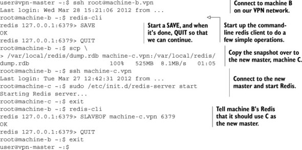


## Redis transactions

Within Redis, there’s a simple method for handling a sequence of reads and writes that will be consistent with each other.         We begin our transaction by calling the special command MULTI, passing our series of commands, followed by EXEC. **The problem is that this simple transaction doesn’t actually do anything until EXEC is called, which means that we can’t use data we read to make decisions until after we may have needed it.**

Use a Redis operation called **WATCH**, which we combine with MULTI and EXEC, and sometimes UNWATCH or DISCARD. When we’ve watched **keys** with WATCH, if at any time some other client replaces, updates, or deletes any keys that we’ve WATCHed before we have performed the EXEC operation, our operations against Redis will fail with an error message when we try to EXEC

Redis will notify clients if someone else modified the data first, which is called optimistic locking (the actual locking that relational databases perform could be viewed as pessimistic)

Please check *listItem* and *purchaseItem* in Java.

## Non-transactional pipelines

```python
pipe = conn.pipeline()
```

By passing True to the pipeline() method (or omitting it), we’re telling our client to wrap the sequence of commands that we’ll call with a MULTI/EXEC pair. If instead of passing True we were to pass False, we’d get an object that prepared and collected commands to execute similar to the transactional pipeline, only it wouldn’t         be wrapped with MULTI/EXEC. 

Please check update_token() and benchmark example in Java.

| Description | Bandwidth | Latency | update_table() calls per second | update_table_pipeline() calls per second |
|---------------------------------------|--------------------------------------------------------------------------------------|-----------------------------------------------------------------------------------------------------------|---------------------------------|------------------------------------------|
| Local machine, Unix domain socket | >1 gigabit | 0.015ms | 3,761 | 6,394 |
| Local machine, localhost | >1 gigabit | 0.015ms | 3,257 | 5,991 |
| Remote machine, shared switch | 1 gigabit | 0.271ms | 739 | 2,841 |
| Remote machine, connected through VPN | 1.8 megabit | 48ms | 3.67 | 18.2 |

For high-latency connections, we can multiply performance by a factor of five using pipelines         over not using pipelines. Even with very low-latency remote connections, we’re able to improve performance by almost four         times.

## Diagnosing performance issues
## redis-benchmark

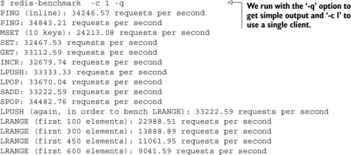

Generally, compared to redis-benchmark running with a single client, we can expect the Python Redis client to perform at roughly 50–60% of what redis-benchmark will tell us for a single client and for nonpipelined commands, depending on the complexity of the command to call.                  If you find that your commands are running at about half of what you’d expect given redis-benchmark (about 25–30% of what redis-benchmark reports), or if you get errors reporting “Cannot assign requested address,” you may be accidentally creating a new connection         for every command.

## Summary

If there are two things you should take from this chapter, they are that the use of replication and append-only files can         go a long way toward keeping your data safe, and that using WATCH/MULTI/EXEC can keep your data from being corrupted by multiple clients working on the same data.

# Application components in Redis

## Auto Completion.

This could be handled by Trie with weight.

## DISTRIBUTED LOCKING
Take care about the time out. Use Setnx and expire to get the lock and make sure the lock could expire.

In order to give our lock a timeout, we’ll use EXPIRE to have Redis time it out automatically. The natural place to put the EXPIRE is immediately after the lock is acquired, and we’ll do that. 
```java
public String acquireLockWithTimeout(
        Jedis conn, String lockName, long acquireTimeout, long lockTimeout)
    {
        String identifier = UUID.randomUUID().toString();
        String lockKey = "lock:" + lockName;
        int lockExpire = (int)(lockTimeout / 1000);

        long end = System.currentTimeMillis() + acquireTimeout;
        while (System.currentTimeMillis() < end) {
            if (conn.setnx(lockKey, identifier) == 1){
                conn.expire(lockKey, lockExpire);
                return identifier;
            }
            if (conn.ttl(lockKey) == -1) {
                conn.expire(lockKey, lockExpire);
            }

            try {
                Thread.sleep(1);
            }catch(InterruptedException ie){
                Thread.currentThread().interrupt();
            }
        }

        // null indicates that the lock was not acquired
        return null;
    }


    public boolean releaseLock(Jedis conn, String lockName, String identifier) {
        String lockKey = "lock:" + lockName;

        while (true){
            conn.watch(lockKey);
            if (identifier.equals(conn.get(lockKey))){
                Transaction trans = conn.multi();
                trans.del(lockKey);
                List<Object> results = trans.exec();
                if (results == null){
                    continue;
                }
                return true;
            }

            conn.unwatch();
            break;
        }

        return false;
    }
```

 using WATCH, MULTI, and EXEC is a way of having an optimistic lock—we aren’t actually locking data, but we’re notified and our changes are canceled if someone else modifies it before we do. By adding explicit locking on the client, we get a few benefits (better performance, a more familiar programming concept, easier-to-use API, and so on), but we need to remember that Redis itself doesn’t respect our locks. It’s up to us to consistently use our locks in addition to or instead of WATCH, MULTI, and EXEC to keep our data consistent and correct.

 ## COUNTING SEMAPHORES

### Basic semaphore.

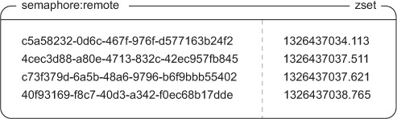

 ```python
def acquire_semaphore(conn, semname, limit, timeout=10):
    identifier = str(uuid.uuid4())                             #A
    now = time.time()

    pipeline = conn.pipeline(True)
    pipeline.zremrangebyscore(semname, '-inf', now - timeout)  #B
    pipeline.zadd(semname, {identifier: now})                  #C
    pipeline.zrank(semname, identifier)                        #D
    if pipeline.execute()[-1] < limit:                         #D
        return identifier

    conn.zrem(semname, identifier)                             #E
    return None
# <end id="_1314_14473_8986"/>
#A A 128-bit random identifier
#B Time out old semaphore holders
#C Try to acquire the semaphore
#D Check to see if we have it
#E We failed to get the semaphore, discard our identifier
#END

# <start id="_1314_14473_8990"/>
def release_semaphore(conn, semname, identifier):
    return conn.zrem(semname, identifier)                      #A
# <end id="_1314_14473_8990"/>
#A Returns True if the semaphore was properly released, False if it had timed out
#END
 ```

 This basic semaphore works well—it’s simple, and it’s very fast. But relying on every process having access to the same system time in order to get the semaphore can cause problems if we have multiple hosts.

## Fair semaphores

In order to minimize problems with inconsistent system times, we’ll add a counter and a second ZSET.

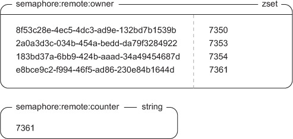

```python

def acquire_fair_semaphore(conn, semname, limit, timeout=10):
    identifier = str(uuid.uuid4())                             #A
    czset = semname + ':owner'
    ctr = semname + ':counter'

    now = time.time()
    pipeline = conn.pipeline(True)
    pipeline.zremrangebyscore(semname, '-inf', now - timeout)  #B
    pipeline.zinterstore(czset, {czset: 1, semname: 0})        #B

    pipeline.incr(ctr)                                         #C
    counter = pipeline.execute()[-1]                           #C

    pipeline.zadd(semname, {identifier: now})                  #D
    pipeline.zadd(czset, {identifier: counter})                #D

    pipeline.zrank(czset, identifier)                          #E
    if pipeline.execute()[-1] < limit:                         #E
        return identifier                                      #F

    pipeline.zrem(semname, identifier)                         #G
    pipeline.zrem(czset, identifier)                           #G
    pipeline.execute()
    return None
# <end id="_1314_14473_9004"/>
#A A 128-bit random identifier
#B Time out old entries
#C Get the counter
#D Try to acquire the semaphore
#E Check the rank to determine if we got the semaphore
#F We got the semaphore
#G We didn't get the semaphore, clean out the bad data
#END

# <start id="_1314_14473_9014"/>
def release_fair_semaphore(conn, semname, identifier):
    pipeline = conn.pipeline(True)
    pipeline.zrem(semname, identifier)
    pipeline.zrem(semname + ':owner', identifier)
    return pipeline.execute()[0]                               #A
# <end id="_1314_14473_9014"/>
#A Returns True if the semaphore was properly released, False if it had timed out
#END

```

Let’s look at figure 6.8, which shows the sequence of operations that are performed when process ID 8372 wants to acquire the semaphore at time 1326437039.100 when there’s a limit of 5.

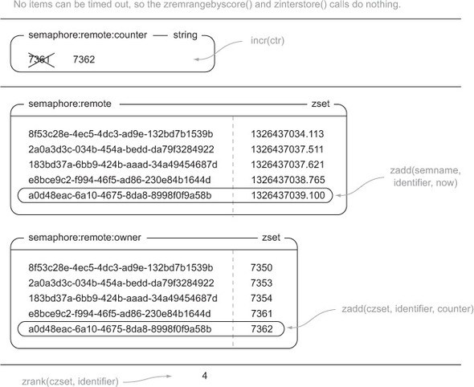

Now we have a semaphore that doesn’t require that all hosts have the same system time, though system times **do need to be within 1 or 2 seconds** in order to ensure that semaphores don’t time out too early, too late, or not at all.

### Refreshing semaphores

Because we already separated the timeout ZSET from the owner ZSET, we can actually refresh timeouts quickly by updating our time in the timeout ZSET, shown in the following listing.

```python
# <start id="_1314_14473_9022"/>
def refresh_fair_semaphore(conn, semname, identifier):
    if conn.zadd(semname, {identifier: time.time()}):          #A
        release_fair_semaphore(conn, semname, identifier)      #B
        return False                                           #B
    return True                                                #C
# <end id="_1314_14473_9022"/>
#A Update our semaphore
#B We lost our semaphore, report back
#C We still have our semaphore
#END
```

### Preventing race conditions

We can see the problem in the following example. If we have two processes A and B that are trying to get one remaining semaphore, and A increments the counter first but B adds its identifier to the ZSETs and checks its identifier’s rank first, then B will get the semaphore. When A then adds its identifier and checks its rank, it’ll “steal” the semaphore from B, but B won’t know until it tries to release or renew the semaphore.

To fully handle all possible race conditions for semaphores in Redis, we need to reuse the earlier distributed lock with timeouts that we built in section 6.2.5. We need to use our earlier lock to help build a correct counting semaphore. Overall, to acquire the semaphore, we’ll first try to acquire the lock for the semaphore with a short timeout. 

```python
# <start id="_1314_14473_9031"/>
def acquire_semaphore_with_lock(conn, semname, limit, timeout=10):
    identifier = acquire_lock(conn, semname, acquire_timeout=.01)
    if identifier:
        try:
            return acquire_fair_semaphore(conn, semname, limit, timeout)
        finally:
            release_lock(conn, semname, identifier)
# <end id="_1314_14473_9031"/>
#END
```

## TASK QUEUES

Right now there are many different pieces of software designed specifically for task queues (ActiveMQ, RabbitMQ, Gearman, Amazon SQS, and others), but there are also ad hoc methods of creating task queues in situations where queues aren’t expected. If you’ve ever had a cron job that scans a database table for accounts that have been modified/checked before or after a specific date/time, and you perform some operation based on the results of that query, you’ve already created a task queue.

### First-in, first-out queues

```python
# <start id="_1314_14473_9056"/>
def send_sold_email_via_queue(conn, seller, item, price, buyer):
    data = {
        'seller_id': seller,                    #A
        'item_id': item,                        #A
        'price': price,                         #A
        'buyer_id': buyer,                      #A
        'time': time.time()                     #A
    }
    conn.rpush('queue:email', json.dumps(data)) #B
# <end id="_1314_14473_9056"/>
#A Prepare the item
#B Push the item onto the queue
#END

# <start id="_1314_14473_9060"/>
def process_sold_email_queue(conn):
    while not QUIT:
        packed = conn.blpop(['queue:email'], 30)                  #A
        if not packed:                                            #B
            continue                                              #B

        to_send = json.loads(packed[1])                           #C
        try:
            fetch_data_and_send_sold_email(to_send)               #D
        except EmailSendError as err:
            log_error("Failed to send sold email", err, to_send)
        else:
            log_success("Sent sold email", to_send)
# <end id="_1314_14473_9060"/>
#A Try to get a message to send using Block pop with timeout
#B No message to send, try again
#C Load the packed email information
#D Send the email using our pre-written emailing function
#END

# <start id="_1314_14473_9066"/>
def worker_watch_queue(conn, queue, callbacks):
    while not QUIT:
        packed = conn.blpop([queue], 30)                    #A
        if not packed:                                      #B
            continue                                        #B

        name, args = json.loads(packed[1])                  #C
        if name not in callbacks:                           #D
            log_error("Unknown callback %s"%name)           #D
            continue                                        #D
        callbacks[name](*args)                              #E
# <end id="_1314_14473_9066"/>
#A Try to get an item from the queue
#B There is nothing to work on, try again
#C Unpack the work item
#D The function is unknown, log the error and try again
#E Execute the task
#END
```

 Take the worker process in listing above: it watches the provided queue and dispatches the JSON-encoded function call to one of a set of known registered callbacks. The item to be executed will be of the form ['FUNCTION_NAME', [ARG1, ARG2, ...]].


* Task priorities

Remember the BLPOP/BRPOP commands—we can provide multiple LISTs in which to pop an item from; the first LIST to have any items in it will have its first item popped (or last if we’re using BRPOP).

```python
# <start id="_1314_14473_9074"/>
def worker_watch_queues(conn, queues, callbacks):   #A
    while not QUIT:
        packed = conn.blpop(queues, 30)             #B
        if not packed:
            continue

        name, args = json.loads(packed[1])
        if name not in callbacks:
            log_error("Unknown callback %s"%name)
            continue
        callbacks[name](*args)
# <end id="_1314_14473_9074"/>
#A The first changed line to add priority support
#B The second changed line to add priority support
#END
```

* Delayed tasks

Normally when we talk about times, we usually start talking about ZSETs. What if, for any item we wanted to execute in the future, we added it to a ZSET instead of a LIST, with its score being the time when we want it to execute? We then have a process that checks for items that should be executed now, and if there are any, the process removes it from the ZSET, adding it to the proper LIST queue.

```python
# <start id="_1314_14473_9094"/>
def execute_later(conn, queue, name, args, delay=0):
    identifier = str(uuid.uuid4())                          #A
    item = json.dumps([identifier, queue, name, args])      #B
    if delay > 0:
        conn.zadd('delayed:', {item: time.time() + delay})  #C
    else:
        conn.rpush('queue:' + queue, item)                  #D
    return identifier                                       #E
# <end id="_1314_14473_9094"/>
#A Generate a unique identifier
#B Prepare the item for the queue
#C Delay the item
#D Execute the item immediately
#E Return the identifier
#END

def poll_queue(conn):
    while not QUIT:
        item = conn.zrange('delayed:', 0, 0, withscores=True)   #A
        if not item or item[0][1] > time.time():                #B
            time.sleep(.01)                                     #B
            continue                                            #B

        item = item[0][0]                                       #C
        identifier, queue, function, args = json.loads(item)    #C

        locked = acquire_lock(conn, identifier)                 #D
        if not locked:                                          #E
            continue                                            #E

        if conn.zrem('delayed:', item):                         #F
            conn.rpush('queue:' + queue, item)                  #F

        release_lock(conn, identifier, locked)                  #G
# <end id="_1314_14473_9099"/>
#A Get the first item in the queue
#B No item or the item is still to be execued in the future
#C Unpack the item so that we know where it should go
#D Get the lock for the item
#E We couldn't get the lock, so skip it and try again
#F Move the item to the proper list queue
#G Release the lock
#END
```


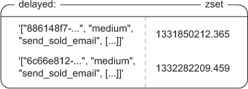

By moving items into queues instead of executing them directly, we only need to have one or two of these running at any time (instead of as many as we have workers), so our polling overhead is kept low. The code for polling our delayed queue is in the following listing.

## PULL MESSAGING

### Single-recipient publish/subscribe replacement

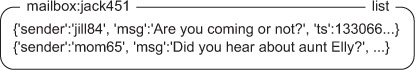

With LISTs, senders can also be notified if the recipient hasn’t been connecting recently, hasn’t received their previous messages,         or maybe has too many pending messages; all by checking the messages in the recipient’s LIST. If the system were limited by a recipient needing to be connected all the time, as is the case with PUBLISH/SUBSCRIBE, messages would get lost, clients wouldn’t know if their message got through, and slow clients could result in outgoing buffers         growing potentially without limit (in older versions of Redis) or getting disconnected (in newer versions of Redis).


###  Multiple-recipient publish/subscribe replacement


Redis PUBLISH/SUBSCRIBE is like group chat where whether someone’s connected determines whether they’re in the group chat. We want to remove that         “need to be connected all the time” requirement, and we’ll implement it in the context of chatting.

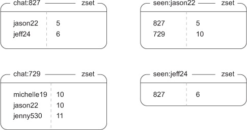

As you can see, user jason22 has seen five of six chat messages sent in chat:827, in which jason22 and jeff24 are participating.

The content of chat sessions themselves will be stored in ZSETs, with messages as members and message IDs as scores. 

```python
# <start id="_1314_14473_9124"/>
def create_chat(conn, sender, recipients, message, chat_id=None):
    chat_id = chat_id or str(conn.incr('ids:chat:'))      #A

    recipients.append(sender)                             #E
    recipientsd = dict((r, 0) for r in recipients)        #E

    pipeline = conn.pipeline(True)
    pipeline.zadd('chat:' + chat_id, recipientsd)         #B
    for rec in recipients:                                #C
        pipeline.zadd('seen:' + rec, {chat_id: 0})        #C
    pipeline.execute()

    return send_message(conn, chat_id, sender, message)   #D
# <end id="_1314_14473_9124"/>
#A Get a new chat id
#E Set up a dictionary of users to scores to add to the chat ZSET
#B Create the set with the list of people participating
#C Initialize the seen zsets
#D Send the message
#END

# <start id="_1314_14473_9127"/>
def send_message(conn, chat_id, sender, message):
    identifier = acquire_lock(conn, 'chat:' + chat_id)
    if not identifier:
        raise Exception("Couldn't get the lock")
    try:
        mid = conn.incr('ids:' + chat_id)                #A
        ts = time.time()                                 #A
        packed = json.dumps({                            #A
            'id': mid,                                   #A
            'ts': ts,                                    #A
            'sender': sender,                            #A
            'message': message,                          #A
        })                                               #A

        conn.zadd('msgs:' + chat_id, {packed: mid})      #B
    finally:
        release_lock(conn, 'chat:' + chat_id, identifier)
    return chat_id
# <end id="_1314_14473_9127"/>
#A Prepare the message
#B Send the message to the chat
#END

```


Generally, when we use a value from Redis in the construction of another value we need to add to Redis, we’ll either need to use a WATCH/MULTI/EXEC transaction or a lock to remove race conditions. We use a lock here for the same performance reasons that we developed it in the first place.


To fetch all pending messages for a user, we need to fetch group IDs and message IDs seen from the user’s ZSET with ZRANGE. When we have the group IDs and the messages that the user has seen, we can perform ZRANGEBYSCORE operations on all of the message ZSETs. After we’ve fetched the messages for the chat, we update the seen ZSET with the proper ID and the user entry in the group ZSET, and we go ahead and clean out any messages from the group chat that have been received by everyone in the chat, as shown         in the following listing.

```python
# <start id="_1314_14473_9132"/>
def fetch_pending_messages(conn, recipient):
    seen = conn.zrange('seen:' + recipient, 0, -1, withscores=True) #A

    pipeline = conn.pipeline(True)

    for chat_id, seen_id in seen:                               #B
        pipeline.zrangebyscore(                                 #B
            b'msgs:' + chat_id, seen_id+1, 'inf')                #B
    chat_info = list(zip(seen, pipeline.execute()))                   #C

    for i, ((chat_id, seen_id), messages) in enumerate(chat_info):
        if not messages:
            continue
        messages[:] = list(map(json.loads, messages))
        seen_id = messages[-1]['id']                            #D
        conn.zadd(b'chat:' + chat_id, {recipient: seen_id})      #D

        min_id = conn.zrange(                                   #E
            b'chat:' + chat_id, 0, 0, withscores=True)           #E

        pipeline.zadd('seen:' + recipient, {chat_id: seen_id})  #F
        if min_id:
            pipeline.zremrangebyscore(                          #G
                b'msgs:' + chat_id, 0, min_id[0][1])             #G
        chat_info[i] = (chat_id, messages)
    pipeline.execute()

    return chat_info
# <end id="_1314_14473_9132"/>
#A Get the last message ids received
#B Fetch all new messages
#C Prepare information about the data to be returned
#D Update the 'chat' ZSET with the most recently received message
#E Discover messages that have been seen by all users
#F Update the 'seen' ZSET
#G Clean out messages that have been seen by all users
#END
```

* Joining and leaving the chat
```python
# <start id="_1314_14473_9135"/>
def join_chat(conn, chat_id, user):
    message_id = int(conn.get('ids:' + chat_id))                #A

    pipeline = conn.pipeline(True)
    pipeline.zadd('chat:' + chat_id, {user: message_id})          #B
    pipeline.zadd('seen:' + user, {chat_id: message_id})          #C
    pipeline.execute()
# <end id="_1314_14473_9135"/>
#A Get the most recent message id for the chat
#B Add the user to the chat member list
#C Add the chat to the users's seen list
#END

# <start id="_1314_14473_9136"/>
def leave_chat(conn, chat_id, user):
    pipeline = conn.pipeline(True)
    pipeline.zrem('chat:' + chat_id, user)                      #A
    pipeline.zrem('seen:' + user, chat_id)                      #A
    pipeline.zcard('chat:' + chat_id)                           #B

    if not pipeline.execute()[-1]:
        pipeline.delete('msgs:' + chat_id)                      #C
        pipeline.delete('ids:' + chat_id)                       #C
        pipeline.execute()
    else:
        oldest = conn.zrange(                                   #D
            'chat:' + chat_id, 0, 0, withscores=True)           #D
        conn.zremrangebyscore('msgs:' + chat_id, 0, oldest[0][1])     #E
# <end id="_1314_14473_9136"/>
#A Remove the user from the chat
#B Find the number of remaining group members
#C Delete the chat
#D Find the oldest message seen by all users
#E Delete old messages from the chat
#END

```
We now have a multiple-recipient messaging system to replace PUBLISH and SUBSCRIBE for group chat.

## DISTRIBUTING FILES WITH REDIS

Usually we don't distribute logs via redis, please use kafka to distribute the logs.

## SUMMARY

If there’s one concept that you should take away from this entire chapter, it’s that although WATCH is a useful command, is built in, convenient, and so forth, having access to a working distributed lock implementation from section 6.2 can make concurrent Redis programming so much easier. Being able to lock at a finer level of detail than an entire key can reduce contention, and being able to lock around related operations can reduce operation complexity. We saw both performance improvements and operation simplicity in our revisited marketplace example from section 4.6, and in our delayed task queue from section 6.4.2.

If there’s a second concept that you should remember, take to heart, and apply in the future, it’s that with a little work, you can build reusable components with Redis. We reused locks explicitly in counting semaphores, delayed task queues, and in our multiple-recipient pub/sub replacement. And we reused our multiple-recipient pub/sub replacement when we distributed files with Redis.


# Search-based applications

## SEARCHING IN REDIS

This preprocessing step is generally known as indexing, and the structures that we create are called inverted indexes. In the search world, inverted indexes are well known and are the underlying structure for almost every search engine that we’ve used on the internet.

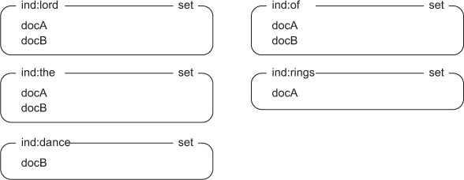


The process of tokenizing text into words

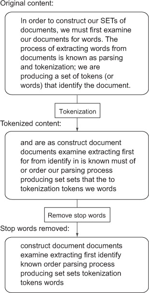

Sometimes we want to search for items with similar meanings and have them considered the same, which we call synonyms (at least in this context). To handle that situation, we could again fetch all of the document SETs for those words and find all of the unique documents, or we could use another built-in Redis operation: SUNION or SUNIONSTORE.


With Redis SET operations and a bit of helper code, we can perform arbitrarily intricate word queries over our documents. Listing 7.2 provides a group of helper functions that will perform SET intersections, unions, and differences over the given words, storing them in temporary SETs with an expiration time that defaults to 30 seconds.

```python
# <start id="_1314_14473_9158"/>
def _set_common(conn, method, names, ttl=30, execute=True):
    id = str(uuid.uuid4())                                  #A
    pipeline = conn.pipeline(True) if execute else conn     #B
    names = ['idx:' + name for name in names]               #C
    getattr(pipeline, method)('idx:' + id, *names)          #D
    pipeline.expire('idx:' + id, ttl)                       #E
    if execute:
        pipeline.execute()                                  #F
    return id                                               #G

def intersect(conn, items, ttl=30, _execute=True):          #H
    return _set_common(conn, 'sinterstore', items, ttl, _execute) #H

def union(conn, items, ttl=30, _execute=True):                    #I
    return _set_common(conn, 'sunionstore', items, ttl, _execute) #I

def difference(conn, items, ttl=30, _execute=True):               #J
    return _set_common(conn, 'sdiffstore', items, ttl, _execute)  #J
# <end id="_1314_14473_9158"/>
#A Create a new temporary identifier
#B Set up a transactional pipeline so that we have consistent results for each individual call
#C Add the 'idx:' prefix to our terms
#D Set up the call for one of the operations
#E Instruct Redis to expire the SET in the future
#F Actually execute the operation
#G Return the id for the caller to process the results
#H Helper function to perform SET intersections
#I Helper function to perform SET unions
#J Helper function to perform SET differences
#END
```

Each of the intersect(), union(), and difference() functions calls another helper function that actually does all of the heavy lifting. This is because they all essentially do the same thing: set up the keys, make the appropriate SET call, update the expiration, and return the new SET’s ID. 

Putting it all together where + denotes synonyms and - denotes unwanted words

```python
# <start id="parse-query"/>
QUERY_RE = re.compile("[+-]?[a-z']{2,}")                #A

def parse(query):
    unwanted = set()                                    #B
    all = []                                            #C
    current = set()                                     #D
    for match in QUERY_RE.finditer(query.lower()):      #E
        word = match.group()                            #F
        prefix = word[:1]                               #F
        if prefix in '+-':                              #F
            word = word[1:]                             #F
        else:                                           #F
            prefix = None                               #F

        word = word.strip("'")                          #G
        if len(word) < 2 or word in STOP_WORDS:         #G
            continue                                    #G

        if prefix == '-':                               #H
            unwanted.add(word)                          #H
            continue                                    #H

        if current and not prefix:                      #I
            all.append(list(current))                   #I
            current = set()                             #I
        current.add(word)                               #J

    if current:                                         #K
        all.append(list(current))                       #K

    return all, list(unwanted)                          #L
# <end id="parse-query"/>
#A Our regular expression for finding wanted, unwanted, and synonym words
#B A unique set of unwanted words
#C Our final result of words that we are looking to intersect
#D The current unique set of words to consider as synonyms
#E Iterate over all words in the search query
#F Discover +/- prefixes, if any
#G Strip any leading or trailing single quotes, and skip anything that is a stop word
#H If the word is unwanted, add it to the unwanted set
#I Set up a new synonym set if we have no synonym prefix and we already have words
#J Add the current word to the current set
#K Add any remaining words to the final intersection
#END

# <start id="search-query"/>
def parse_and_search(conn, query, ttl=30):
    all, unwanted = parse(query)                                    #A
    if not all:                                                     #B
        return None                                                 #B

    to_intersect = []
    for syn in all:                                                 #D
        if len(syn) > 1:                                            #E
            to_intersect.append(union(conn, syn, ttl=ttl))          #E
        else:                                                       #F
            to_intersect.append(syn[0])                             #F

    if len(to_intersect) > 1:                                       #G
        intersect_result = intersect(conn, to_intersect, ttl=ttl)   #G
    else:                                                           #H
        intersect_result = to_intersect[0]                          #H

    if unwanted:                                                    #I
        unwanted.insert(0, intersect_result)                        #I
        return difference(conn, unwanted, ttl=ttl)                  #I

    return intersect_result                                         #J
# <end id="search-query"/>
#A Parse the query
#B If there are no words in the query that are not stop words, we don't have a result
#D Iterate over each list of synonyms
#E If the synonym list is more than one word long, then perform the union operation
#F Otherwise use the individual word directly
#G If we have more than one word/result to intersect, intersect them
#H Otherwise use the individual word/result directly
#I If we have any unwanted words, remove them from our earlier result and return it
#J Otherwise return the intersection result
#END
```

## SORTED INDEXES

we used a helper function for handling the creation of a temporary ID, the ZINTERSTORE call, and setting the expiration time of the result ZSET. The zintersect() and zunion() helper functions are shown next.

```python
# <start id="zset_scored_composite"/>
def search_and_zsort(conn, query, id=None, ttl=300, update=1, vote=0,   #A
                    start=0, num=20, desc=True):                        #A

    if id and not conn.expire(id, ttl):     #B
        id = None                           #B

    if not id:                                      #C
        id = parse_and_search(conn, query, ttl=ttl) #C

        scored_search = {
            id: 0,                                  #I
            'sort:update': update,                  #D
            'sort:votes': vote                      #D
        }
        id = zintersect(conn, scored_search, ttl)   #E

    pipeline = conn.pipeline(True)
    pipeline.zcard('idx:' + id)                                     #F
    if desc:                                                        #G
        pipeline.zrevrange('idx:' + id, start, start + num - 1)     #G
    else:                                                           #G
        pipeline.zrange('idx:' + id, start, start + num - 1)        #G
    results = pipeline.execute()

    return results[0], results[1], id                               #H
# <end id="zset_scored_composite"/>
#A Like before, we'll optionally take a previous result id for pagination if the result is still available
#B We will refresh the search result's TTL if possible
#C If our search result expired, or if this is the first time we've searched, perform the standard SET search
#I We use the 'id' key for the intersection, but we don't want it to count towards weights
#D Set up the scoring adjustments for balancing update time and votes. Remember: votes can be adjusted to 1, 10, 100, or higher depending on the sorting result desired.
#E Intersect using our helper function that we define in listing 7.7
#F Fetch the size of the result ZSET
#G Handle fetching a "page" of results
#H Return the results and the id for pagination
#END


# <start id="zset_helpers"/>
def _zset_common(conn, method, scores, ttl=30, **kw):
    id = str(uuid.uuid4())                                  #A
    execute = kw.pop('_execute', True)                      #J
    pipeline = conn.pipeline(True) if execute else conn     #B
    for key in list(scores.keys()):                               #C
        scores['idx:' + key] = scores.pop(key)              #C
    getattr(pipeline, method)('idx:' + id, scores, **kw)    #D
    pipeline.expire('idx:' + id, ttl)                       #E
    if execute:                                             #F
        pipeline.execute()                                  #F
    return id                                               #G

def zintersect(conn, items, ttl=30, **kw):                              #H
    return _zset_common(conn, 'zinterstore', dict(items), ttl, **kw)    #H

def zunion(conn, items, ttl=30, **kw):                                  #I
    return _zset_common(conn, 'zunionstore', dict(items), ttl, **kw)    #I
# <end id="zset_helpers"/>
#A Create a new temporary identifier
#B Set up a transactional pipeline so that we have consistent results for each individual call
#C Add the 'idx:' prefix to our inputs
#D Set up the call for one of the operations
#E Instruct Redis to expire the ZSET in the future
#F Actually execute the operation, unless explicitly instructed not to by the caller
#G Return the id for the caller to process the results
#H Helper function to perform ZSET intersections
#I Helper function to perform ZSET unions
#J Allow the passing of an argument to determine whether we should defer pipeline execution
#END
```

## AD TARGETING

**Please read the article**, pay attention to the function intersect(), union(), and difference(), zintersect and zunion. They will create intermediem set which could be use in further processing. Also the parameter in json is tricky. Look at below example, matched_ads is variable and *'ad:value:'* is a string.

```python
# <start id="location_target"/>
def match_location(pipe, locations):
    required = ['req:' + loc for loc in locations]                  #A
    matched_ads = union(pipe, required, ttl=300, _execute=False)    #B
    return matched_ads, zintersect(pipe,                            #C
        {matched_ads: 0, 'ad:value:': 1}, _execute=False)  #C
# <end id="location_target"/>
#A Calculate the SET key names for all of the provided locations
#B Calculate the SET of matched ads that are valid for this location
#C Return the matched ads SET id, as well as the id of the ZSET that includes the base eCPM of all of the matched ads
#END
```

## JOB SEARCH

 Start with every job having its own SET, with members being the skills that the job requires. To check whether a candidate has all of the requirements for a given job, we’d add the candidate’s skills to a SET and then perform the SDIFF of the job and the candidate’s skills.

 ```python
# <start id="slow_job_search"/>
def add_job(conn, job_id, required_skills):
    conn.sadd('job:' + job_id, *required_skills)        #A

def is_qualified(conn, job_id, candidate_skills):
    temp = str(uuid.uuid4())
    pipeline = conn.pipeline(True)
    pipeline.sadd(temp, *candidate_skills)              #B
    pipeline.expire(temp, 5)                            #B
    pipeline.sdiff('job:' + job_id, temp)               #C
    return not pipeline.execute()[-1]                   #D
# <end id="slow_job_search"/>
#A Add all required job skills to the job's SET
#B Add the candidate's skills to a temporary SET with an expiration time
#C Calculate the SET of skills that the job requires that the user doesn't have
#D Return True if there are no skills that the candidate does not have
#END
 ```
but it suffers from the fact that to find all of the jobs for a given candidate, we must check each job individually. This won’t scale, but there are solutions that will.

### Approaching the problem like search

Rather than talk about jobs with skills, we need to flip the problem around like we did with the other search problems described in this chapter. We start with one SET per skill, which stores all of the jobs that require that skill. In a required skills ZSET, we store the total number of skills that a job requires. The code that sets up our index looks like the next listing.

To perform a search for jobs that a candidate has all of the skills for, we need to approach the search like we did with the         bonuses to ad targeting in section 7.3.3. More specifically, we’ll perform a ZUNIONSTORE operation over skill SETs to calculate a total score for each job. This score represents how many skills the candidate has for each of the jobs.

```python

# <start id="job_search_index"/>
def index_job(conn, job_id, skills):
    pipeline = conn.pipeline(True)
    for skill in skills:
        pipeline.sadd('idx:skill:' + skill, job_id)             #A
    pipeline.zadd('idx:jobs:req', {job_id: len(set(skills))})   #B
    pipeline.execute()
# <end id="job_search_index"/>
#A Add the job id to all appropriate skill SETs
#B Add the total required skill count to the required skills ZSET
#END

# <start id="job_search_results"/>
def find_jobs(conn, candidate_skills):
    skills = {}                                                 #A
    for skill in set(candidate_skills):                         #A
        skills['skill:' + skill] = 1                            #A

    job_scores = zunion(conn, skills)                           #B
    final_result = zintersect(                                  #C
        conn, {job_scores:-1, 'jobs:req':1})                    #C

    return conn.zrangebyscore('idx:' + final_result, 0, 0)      #D
# <end id="job_search_results"/>
#A Set up the dictionary for scoring the jobs
#B Calculate the scores for each of the jobs
#C Calculate how many more skills the job requires than the candidate has
#D Return the jobs that the candidate has the skills for
#END

```

Again, we first find the scores for each job. After we have the scores for each job, we subtract each job score from the total         score necessary to match. In that final result, any job with a ZSET score of 0 is a job that the candidate has all of the skills for.

Depending on the number of jobs and searches that are being performed, our job-search system may or may not perform as fast         as we need it to, especially with large numbers of jobs or searches. But if we apply sharding techniques that we’ll discuss in chapter 9, we can break the large calculations into smaller pieces and calculate partial results bit by bit. Alternatively, if we first find the SET of jobs in a location to search for jobs, we could perform the same kind of optimization that we performed with ad targeting in section 7.3.3, which could greatly improve job-search performance.

More examples, to search job levels or years of experience

```python
# 0 is beginner, 1 is intermediate, 2 is expert
SKILL_LEVEL_LIMIT = 2

def index_job_levels(conn, job_id, skill_levels):
    total_skills = len(set(skill for skill, level in skill_levels))
    pipeline = conn.pipeline(True)
    for skill, level in skill_levels:
        level = min(level, SKILL_LEVEL_LIMIT)
        for wlevel in range(level, SKILL_LEVEL_LIMIT+1):  ## add all the levels equal or greater than the required level.
            pipeline.sadd('idx:skill:%s:%s'%(skill,wlevel), job_id)
    pipeline.zadd('idx:jobs:req', {job_id: total_skills})  ## count is the same
    pipeline.execute()

def search_job_levels(conn, skill_levels):
    skills = {}
    for skill, level in skill_levels:
        level = min(level, SKILL_LEVEL_LIMIT)
        skills['skill:%s:%s'%(skill,level)] = 1

    job_scores = zunion(conn, skills)
    final_result = zintersect(conn, {job_scores:-1, 'jobs:req':1})

    return conn.zrangebyscore('idx:' + final_result, '-inf', 0) # get from - infinite to 0


def index_job_years(conn, job_id, skill_years):
    total_skills = len(set(skill for skill, years in skill_years))
    pipeline = conn.pipeline(True)
    for skill, years in skill_years:
        pipeline.zadd(
            'idx:skill:%s:years'%skill, {job_id:max(years, 0)})
    pipeline.sadd('idx:jobs:all', job_id)
    pipeline.zadd('idx:jobs:req', {job_id:total_skills})
    pipeline.execute()

def search_job_years(conn, skill_years):
    skill_years = dict(skill_years)
    pipeline = conn.pipeline(True)

    union = []
    for skill, years in skill_years.items():
        sub_result = zintersect(pipeline,
            {'jobs:all':-years, 'skill:%s:years'%skill:1}, _execute=False) #减去当前有的years，如果当前years超过了要求，结果就会是负的
        pipeline.zremrangebyscore('idx:' + sub_result, '(0', 'inf')# Delete all the positive job with positive skills
        union.append(
            zintersect(pipeline, {'jobs:all':1, sub_result:0}, _execute=False)) # union the negative result together, now we have all the skill count required like the first example.

    job_scores = zunion(pipeline, dict((key, 1) for key in union), _execute=False)
    final_result = zintersect(pipeline, {job_scores:-1, 'jobs:req':1}, _execute=False)

    pipeline.zrangebyscore('idx:' + final_result, '-inf', 0)
    return pipeline.execute()[-1]

```

# Building a simple social network

## USERS AND STATUSES

### User information


Create a user in hash

```python
# <start id="create-twitter-user"/>
def create_user(conn, login, name):
    llogin = login.lower()
    lock = acquire_lock_with_timeout(conn, 'user:' + llogin, 1) #A
    if not lock:                            #B
        return None                         #B

    if conn.hget('users:', llogin):         #C
        release_lock(conn, 'user:' + llogin, lock)  #C
        return None                         #C

    id = conn.incr('user:id:')              #D
    pipeline = conn.pipeline(True)
    pipeline.hset('users:', llogin, id)     #E
    pipeline.hmset('user:%s'%id, {          #F
        'login': login,                     #F
        'id': id,                           #F
        'name': name,                       #F
        'followers': 0,                     #F
        'following': 0,                     #F
        'posts': 0,                         #F
        'signup': time.time(),              #F
    })
    pipeline.execute()
    release_lock(conn, 'user:' + llogin, lock)  #G
    return id                               #H
# <end id="create-twitter-user"/>
#A Try to acquire the lock for the lowercased version of the login name. This function is defined in chapter 6
#B If we couldn't get the lock, then someone else already has the same login name
#C We also store a HASH of lowercased login names to user ids, so if there is already a login name that maps to an ID, we know and won't give it to a second person
#D Each user is given a unique id, generated by incrementing a counter
#E Add the lowercased login name to the HASH that maps from login names to user ids
#F Add the user information to the user's HASH
#G Release the lock over the login name
#H Return the id of the user
#END
```
This lock is necessary: it guarantees that we won’t have two requests trying to create a user with the same login at the same time.

### Status messages

As was the case with user information, we’ll store status message information inside a HASH.


```python
# <start id="create-twitter-status"/>
def create_status(conn, uid, message, **data):
    pipeline = conn.pipeline(True)
    pipeline.hget('user:%s'%uid, 'login')   #A
    pipeline.incr('status:id:')             #B
    login, id = pipeline.execute()

    if not login:                           #C
        return None                         #C

    data.update({
        'message': message,                 #D
        'posted': time.time(),              #D
        'id': id,                           #D
        'uid': uid,                         #D
        'login': login,                     #D
    })
    pipeline.hmset('status:%s'%id, data)    #D
    pipeline.hincrby('user:%s'%uid, 'posts')#E
    pipeline.execute()
    return id                               #F
# <end id="create-twitter-status"/>
#A Get the user's login name from their user id
#B Create a new id for the status message
#C Verify that we have a proper user account before posting
#D Prepare and set the data for the status message
#E Record the fact that a status message has been posted
#F Return the id of the newly created status message
#END
```

## HOME TIMELINE

For the home timeline, which will store the list of status messages that have been posted by the people that the current user is following, we’ll use a ZSET to store status IDs as ZSET members, with the timestamp of when the message was posted being used as the score.

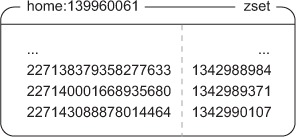

```python
# <start id="fetch-page"/>
def get_status_messages(conn, uid, timeline='home:', page=1, count=30):#A
    statuses = conn.zrevrange(                                  #B
        '%s%s'%(timeline, uid), (page-1)*count, page*count-1)   #B

    pipeline = conn.pipeline(True)
    for id in statuses:                                         #C
        pipeline.hgetall('status:%s'%(to_str(id),))             #C

    return [_f for _f in pipeline.execute() if _f]                     #D
# <end id="fetch-page"/>
#A We will take an optional 'timeline' argument, as well as page size and status message counts
#B Fetch the most recent status ids in the timeline
#C Actually fetch the status messages themselves
#D Filter will remove any 'missing' status messages that had been previously deleted
#END
```

## FOLLOWERS/FOLLOWING LISTS

To keep a list of followers and a list of those people that a user is following, we’ll also store user IDs and timestamps in ZSETs as well, with members being user IDs, and scores being the timestamp of when the user was followed.

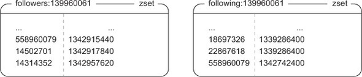


```python
# <start id="follow-user"/>
HOME_TIMELINE_SIZE = 1000
def follow_user(conn, uid, other_uid):
    fkey1 = 'following:%s'%uid          #A
    fkey2 = 'followers:%s'%other_uid    #A

    if conn.zscore(fkey1, other_uid):   #B
        return None                     #B

    now = time.time()

    pipeline = conn.pipeline(True)
    pipeline.zadd(fkey1, {other_uid: now})    #C
    pipeline.zadd(fkey2, {uid: now})          #C
    pipeline.zrevrange('profile:%s'%other_uid,      #E
        0, HOME_TIMELINE_SIZE-1, withscores=True)   #E
    following, followers, status_and_score = pipeline.execute()[-3:]

    pipeline.hincrby('user:%s'%uid, 'following', int(following))        #F
    pipeline.hincrby('user:%s'%other_uid, 'followers', int(followers))  #F
    if status_and_score:
        pipeline.zadd('home:%s'%uid, dict(status_and_score))  #G
    pipeline.zremrangebyrank('home:%s'%uid, 0, -HOME_TIMELINE_SIZE-1)#G

    pipeline.execute()
    return True                         #H
# <end id="follow-user"/>
#A Cache the following and followers key names
#B If the other_uid is already being followed, return
#C Add the uids to the proper following and followers ZSETs
#E Fetch the most recent HOME_TIMELINE_SIZE status messages from the newly followed user's profile timeline
#F Update the known size of the following and followers ZSETs in each user's HASH
#G Update the home timeline of the following user, keeping only the most recent 1000 status messages
#H Return that the user was correctly followed
#END

# <start id="unfollow-user"/>
def unfollow_user(conn, uid, other_uid):
    fkey1 = 'following:%s'%uid          #A
    fkey2 = 'followers:%s'%other_uid    #A

    if not conn.zscore(fkey1, other_uid):   #B
        return None                         #B

    pipeline = conn.pipeline(True)
    pipeline.zrem(fkey1, other_uid)                 #C
    pipeline.zrem(fkey2, uid)                       #C
    pipeline.zrevrange('profile:%s'%other_uid,      #E
        0, HOME_TIMELINE_SIZE-1)                    #E
    following, followers, statuses = pipeline.execute()[-3:]

    pipeline.hincrby('user:%s'%uid, 'following', -int(following))        #F
    pipeline.hincrby('user:%s'%other_uid, 'followers', -int(followers))  #F
    if statuses:
        pipeline.zrem('home:%s'%uid, *statuses)                 #G

    pipeline.execute()
    return True                         #H
# <end id="unfollow-user"/>
#A Cache the following and followers key names
#B If the other_uid is not being followed, return
#C Remove the uids the proper following and followers ZSETs
#E Fetch the most recent HOME_TIMELINE_SIZE status messages from the user that we stopped following
#F Update the known size of the following and followers ZSETs in each user's HASH
#G Update the home timeline, removing any status messages from the previously followed user
#H Return that the unfollow executed successfully
#END
```

## POSTING OR DELETING A STATUS UPDATE
