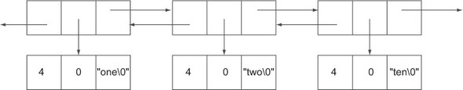
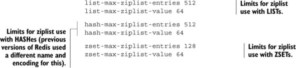
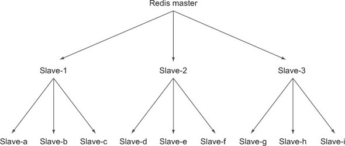
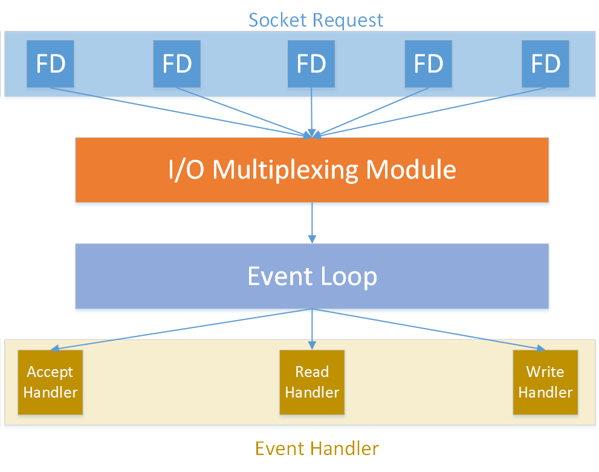
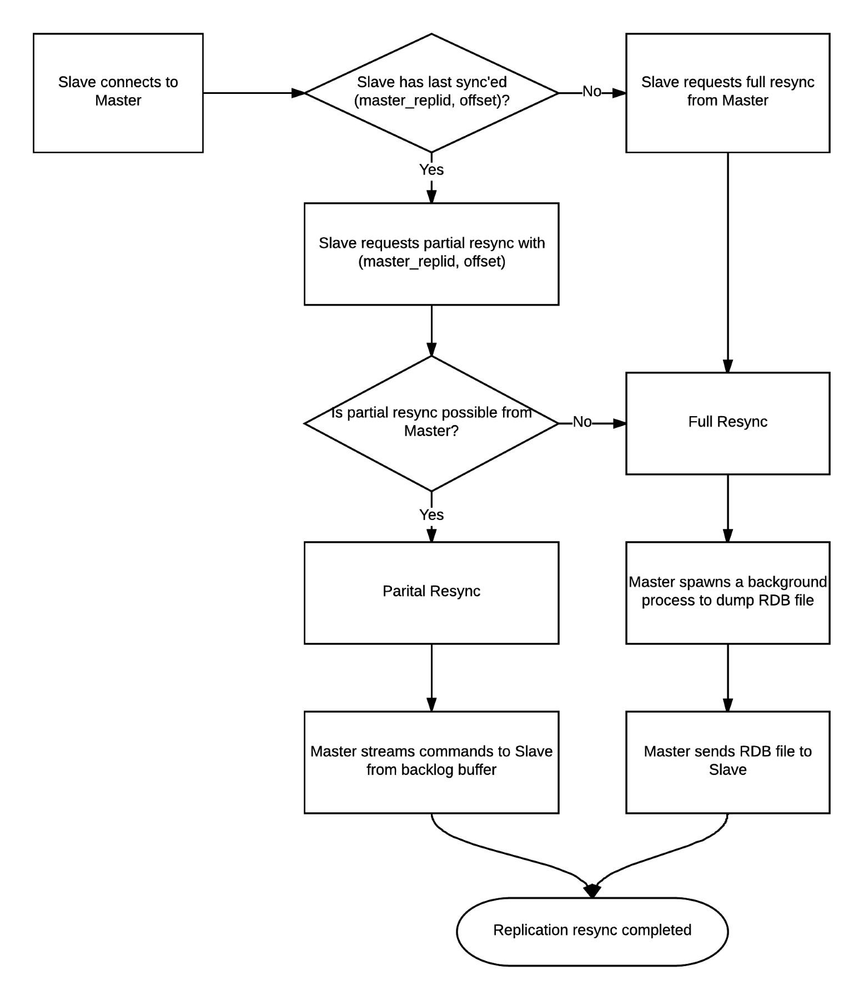
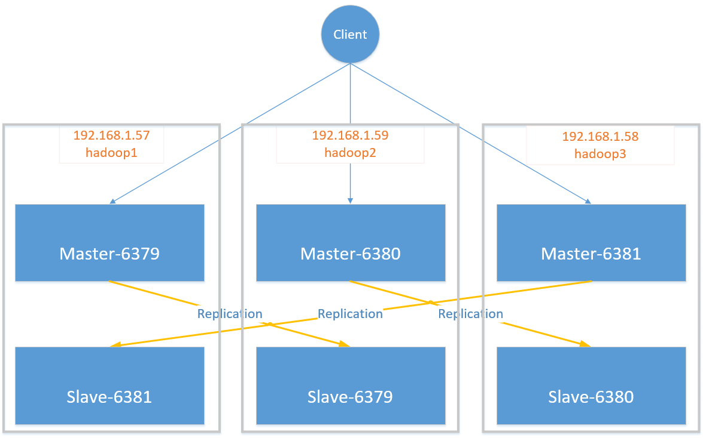

# redisinaction-learning
study redis in action.

# Start the redis with Docker.
1. Start the docker terminal
2. Run below command to download the redis image from docker hub.
```
docker pull redis
docker run --name redis-test -d redis
docker run -p 6379:6379  --name myredis   -d redis  redis-server --appendonly yes
docker start myredis
```

# Chapter 2 and 3

1. It is better to debug the code in eclipse, because some backgroud thread may clean the data during the runtime. To debug, you could track the data change in the redis.
2. Check out the code comments to find out more about how to handle big amount of data.
3. In Redis, when we talk about a group of commands as being atomic, we mean that no other client can read or change data while we’re reading or changing that same data.
4. SORT allows us to sort LISTs, SETs, and ZSETs according to data in the LIST/SET/ZSET data stored in STRING keys, or even data stored in HASHes
5. If you like the simplicity of using PUBLISH/SUBSCRIBE, and you’re okay with the chance that you may lose a little data, then feel free to use pub/sub instead of our methods, as         we also do in section 8.5; just remember to configure client-output-buffer-limit pubsub reasonably before starting.
6. **In Redis, every command passed as part of a basic MULTI/EXEC transaction is executed one after another until they’ve completed. After they’ve completed, other clients may execute their commands. Redis waits to execute all of the provided commands between MULTI and EXEC until all of the commands have been received and followed by an EXEC.**

7. We can only expire entire keys, not individual items (this is also why we use ZSETs with timestamps in a few places)

## Commands

## String
Command

Example use and description
* INCR	INCR key-name—Increments the value stored at the key by 1
* DECR	DECR key-name—Decrements the value stored at the key by 1
* INCRBY	INCRBY key-name amount—Increments the value stored at the key by the provided integer value
* DECRBY	DECRBY key-name amount—Decrements the value stored at the key by the provided integer value
* INCRBYFLOAT	INCRBYFLOAT key-name amount—Increments the value stored at the key by the provided float value (available in Redis 2.6 and later)

1. APPEND	APPEND key-name value—Concatenates the provided value to the string already stored at the given key
2. GETRANGE	GETRANGE key-name start end—Fetches the substring, including all characters from the start offset to the end offset, inclusive
3. SETRANGE	SETRANGE key-name offset value—Sets the substring starting at the provided offset to the given value
4. GETBIT	GETBIT key-name offset—Treats the byte string as a bit string, and returns the value of the bit in the string at the provided bit offset
5. SETBIT	SETBIT key-name offset value—Treats the byte string as a bit string, and sets the value of the bit in the string at the provided bit offset
6. BITCOUNT	BITCOUNT key-name [start end]—Counts the number of 1 bits in the string, optionally starting and finishing at the provided byte offsets
7. BITOP	BITOP operation dest-key key-name [key-name ...]—Performs one of the bitwise operations, AND, OR, XOR, or NOT, on the strings provided, storing the result in the destination key


## LISTS

* RPUSH	RPUSH key-name value [value ...]—Pushes the value(s) onto the right end of the list
* LPUSH	LPUSH key-name value [value ...]—Pushes the value(s) onto the left end of the list
* RPOP	RPOP key-name—Removes and returns the rightmost item from the list
* LPOP	LPOP key-name—Removes and returns the leftmost item from the list
* LINDEX	LINDEX key-name offset—Returns the item at the given offset
* LRANGE	LRANGE key-name start end—Returns the items in the list at the offsets from start to end, inclusive
* LTRIM	LTRIM key-name start end—Trims the list to only include items at indices between start and end, inclusive
* BLPOP	BLPOP key-name [key-name ...] timeout—Pops the leftmost item from the first non-empty LIST, or waits the timeout in seconds for an item
* BRPOP	BRPOP key-name [key-name ...] timeout—Pops the rightmost item from the first non-empty LIST, or waits the timeout in seconds for an item
* RPOPLPUSH	RPOPLPUSH source-key dest-key—Pops the rightmost item from the source and LPUSHes the item to the destination, also returning the item to the user
* BRPOPLPUSH	BRPOPLPUSH source-key dest-key timeout—Pops the rightmost item from the source and LPUSHes the item to the destination, also returning the item to the user, and waiting up to the timeout if the source is empty

## SETS

* SADD	SADD key-name item [item ...]—Adds the items to the set and returns the number of items added that weren’t already present
* SREM	SREM key-name item [item ...]—Removes the items and returns the number of items that were removed
* SISMEMBER	SISMEMBER key-name item—Returns whether the item is in the SET
* SCARD	SCARD key-name—Returns the number of items in the SET
* SMEMBERS	SMEMBERS key-name—Returns all of the items in the SET as a Python set
* SRANDMEMBER	SRANDMEMBER key-name [count]—Returns one or more random items from the SET. When count is positive, Redis will return count distinct randomly chosen items, and when count is negative, Redis will return count randomly chosen items that may not be distinct.
* SPOP	SPOP key-name—Removes and returns a random item from the SET
* SMOVE	SMOVE source-key dest-key item—If the item is in the source, removes the item from the source and adds it to the destination, returning if the item was moved
* SDIFF	SDIFF key-name [key-name ...]—Returns the items in the first SET that weren’t in any of the other SETs (mathematical set difference operation)
* SDIFFSTORE	SDIFFSTORE dest-key key-name [key-name ...]—Stores at the dest-key the items in the first SET that weren’t in any of the other SETs (mathematical set difference operation)
* SINTER	SINTER key-name [key-name ...]—Returns the items that are in all of the SETs (mathematical set intersection operation)
* SINTERSTORE	SINTERSTORE dest-key key-name [key-name ...]—Stores at the dest-key the items that are in all of the SETs (mathematical set intersection operation)
* SUNION	SUNION key-name [key-name ...]—Returns the items that are in at least one of the SETs (mathematical set union operation)
* SUNIONSTORE	SUNIONSTORE dest-key key-name [key-name ...]—Stores at the dest-key the items that are in at least one of the SETs (mathematical set union operation)

## HASHES

* HMGET	HMGET key-name key [key ...]—Fetches the values at the fields in the HASH
* HMSET	HMSET key-name key value [key value ...]—Sets the values of the fields in the HASH
* HDEL	HDEL key-name key [key ...]—Deletes the key-value pairs in the HASH, returning the number of pairs that were found and deleted
* HLEN	HLEN key-name—Returns the number of key-value pairs in the HASH
* HEXISTS	HEXISTS key-name key—Returns whether the given key exists in the HASH
* HKEYS	HKEYS key-name—Fetches the keys in the HASH
* HVALS	HVALS key-name—Fetches the values in the HASH
* HGETALL	HGETALL key-name—Fetches all key-value pairs from the HASH
* HINCRBY	HINCRBY key-name key increment—Increments the value stored at the given key by the integer increment
* HINCRBYFLOAT	HINCRBYFLOAT key-name key increment—Increments the value stored at the given key by the float increment


## SORTED SETS

* ZADD	ZADD key-name score member [score member ...]—Adds members with the given scores to the ZSET
* ZREM	ZREM key-name member [member ...]—Removes the members from the ZSET, returning the number of members that were removed
* ZCARD	ZCARD key-name—Returns the number of members in the ZSET
* ZINCRBY	ZINCRBY key-name increment member—Increments the member in the ZSET
* ZCOUNT	ZCOUNT key-name min max—Returns the number of members with scores between the provided minimum and maximum
* ZRANK	ZRANK key-name member—Returns the position of the given member in the ZSET
* ZSCORE	ZSCORE key-name member—Returns the score of the member in the ZSET
* ZRANGE	ZRANGE key-name start stop [WITHSCORES]—Returns the members and optionally the scores for the members with ranks between start and stop
* ZREVRANK	ZREVRANK key-name member—Returns the position of the member in the ZSET, with members ordered in reverse
* ZREVRANGE	ZREVRANGE key-name start stop [WITHSCORES]—Fetches the given members from the ZSET by rank, with members in reverse order
* ZRANGEBYSCORE	ZRANGEBYSCORE key min max [WITHSCORES] [LIMIT offset count]—Fetches the members between min and max
* ZREVRANGEBYSCORE	ZREVRANGEBYSCORE key max min [WITHSCORES] [LIMIT offset count]—Fetches the members in reverse order between min and max
* ZREMRANGEBYRANK	ZREMRANGEBYRANK key-name start stop—Removes the items from the ZSET with ranks between start and stop
* ZREMRANGEBYSCORE	ZREMRANGEBYSCORE key-name min max—Removes the items from the ZSET with scores between min and max
* ZINTERSTORE	ZINTERSTORE dest-key key-count key [key ...] [WEIGHTS weight [weight ...]] [AGGREGATE SUM|MIN|MAX]—Performs a SET-like intersection of the provided ZSETs
* ZUNIONSTORE	ZUNIONSTORE dest-key key-count key [key ...] [WEIGHTS weight [weight ...]] [AGGREGATE SUM|MIN|MAX]—Performs a SET-like union of the provided ZSETs

## Expires

* PERSIST	PERSIST key-name—Removes the expiration from a key
* TTL	TTL key-name—Returns the amount of time remaining before a key will expire
* EXPIRE	EXPIRE key-name seconds—Sets the key to expire in the given number of seconds
* EXPIREAT	EXPIREAT key-name timestamp—Sets the expiration time as the given Unix timestamp
* PTTL	PTTL key-name—Returns the number of milliseconds before the key will expire (available in Redis 2.6 and later)
* PEXPIRE	PEXPIRE key-name milliseconds—Sets the key to expire in the given number of milliseconds (available in Redis 2.6 and later)
* PEXPIREAT	PEXPIREAT key-name timestamp-milliseconds—Sets the expiration time to be the given Unix timestamp specified in milliseconds (available in Redis 2.6 and later)


# Chapter 4 Keeping data safe and ensuring performance

## Persisting data to disk
### Snapshots
Within Redis, there are two different ways of persisting data to disk. One is a method called **snapshotting** that takes the data as it exists at one moment in time and writes it to disk. The other method is called **AOF**, or append-only file, and it works by copying incoming write commands to disk as they happen. 

Any Redis client can initiate a snapshot by calling the **BGSAVE** command. On platforms that support BGSAVE (basically all platforms except for Windows), Redis will fork, and the child process will write the snapshot to disk while the parent process continues to respond to commands.                            

When a process forks, the underlying operating system makes a copy of the process. On Unix and Unix-like systems, the copying                  process is optimized such that, initially, all memory is shared between the child and parent processes. When either the parent                  or child process writes to memory, that memory will stop being shared

A Redis client can also initiate a snapshot by calling the **SAVE** command, which causes Redis to stop responding to any/all commands until the snapshot completes. This command isn’t commonly used, except in situations where we need our data on disk, and either we’re okay waiting for it to complete, or we don’t have enough memory for a BGSAVE.

If Redis is configured with save lines, such as *save 60 10000*, Redis will automatically trigger a BGSAVE operation if 10,000 writes have occurred within 60 seconds since the last successful save has started (using the configuration            option described). When multiple save lines are present, any time one of the rules match, a BGSAVE is triggered.

As a point of personal experience, I’ve run Redis servers that used 50 gigabytes of memory on machines with 68 gigabytes of         memory inside a cloud provider running Xen virtualization. When trying to use BGSAVE with clients writing to Redis, forking would take 15 seconds or more, followed by 15–20 minutes for the snapshot to complete.         But with SAVE, the snapshot would finish in 3–5 minutes. For our use, a daily snapshot at 3 a.m. was sufficient, so we wrote scripts that         would stop clients from trying to access Redis, call SAVE, wait for the SAVE to finish, back up the resulting snapshot, and then signal to the clients that they could continue.

### Append-only file persistence

anyone could recover the entire dataset by replaying the append-only log from the beginning to the end. Redis has functionality that does this as well, and it’s enabled by setting the configuration option appendonly yes

* _always_	Every write command to Redis results in a write to disk. This slows Redis down substantially if used.
* _everysec_	Once per second, explicitly syncs write commands to disk.
* _no_	Lets the operating system control syncing to disk.

Append-only files are flexible, offering a variety of options to ensure that almost every level of paranoia can be addressed.         But there’s a dark side to AOF persistence, and that is **file size**.

**Rewriting/compacting append-only files**

Over         time, a growing AOF could cause your disk to run out of space, but more commonly, upon restart, Redis will be executing every         command in the AOF in order. When handling large AOFs, Redis can take a very long time to start up.                  To solve the growing AOF problem, we can use BGREWRITEAOF, which will rewrite the AOF to be as short as possible by removing redundant commands. BGREWRITEAOF works similarly to the snapshotting BGSAVE: performing a fork and subsequently rewriting the append-only log in the child.

Using AOFs, there are two configuration options that enable automatic BGREWRITEAOF execution: *auto-aof-rewrite-percentage* and *auto-aof-rewrite-min-size*. Using the example values of *auto-aof-rewrite-percentage* 100 and *auto-aof-rewrite-min-size* 64mb, when AOF is enabled, Redis will initiate a BGREWRITEAOF when the AOF is at least 100% larger than it was when Redis last finished rewriting the AOF, and when the AOF is at least         64 megabytes in size.

## Replicating data to other machines
Though a variety of options control behavior of the slave itself, only one option is really necessary to enable slaving: **slaveof**. If we were to set *slaveof host port* in our configuration file, the Redis that’s started with that configuration will use the provided host and port as the master         Redis server it should connect to. If we have an already running system, we can tell a Redis server to stop slaving, or even         to slave to a new or different master. To connect to a new master, we can use the SLAVEOF host port command, or if we want to stop updating data from the master, we can use **SLAVEOF no one**.


| Step | Master operations                                                                                        | Slave operations                                                                                          |   |   |
|------|----------------------------------------------------------------------------------------------------------|-----------------------------------------------------------------------------------------------------------|---|---|
| 1    | (waiting for a command)                                                                                  | (Re-)connects to the master; issues the SYNC command                                                      |   |   |
| 2    | Starts BGSAVE operation; keeps a backlog of all write commands sent after BGSAVE                         | Serves old data (if any), or returns errors to commands (depending on configuration)                      |   |   |
| 3    | Finishes BGSAVE; starts sending the snapshot to the slave; continues holding a backlog of write commands | Discards all old data (if any); starts loading the dump as it’s received                                  |   |   |
| 4    | Finishes sending the snapshot to the slave; starts sending the write command backlog to the slave        | Finishes parsing the dump; starts responding to commands normally again                                   |   |   |
| 5    | Finishes sending the backlog; starts live streaming of write commands as they happen                     | Finishes executing backlog of write commands from the master; continues executing commands as they happen |   |   |


* when a slave initially connects to a master, any data that had been in memory will be lost, to be replaced by the data coming from the         master. 
* Redis doesn’t support master-master replication


Below is the code to verify the data is sync between master and slave.
```python
def wait_for_sync(mconn, sconn):
    identifier = str(uuid.uuid4())
    mconn.zadd('sync:wait', {identifier: time.time()})      #A

    while not sconn.info()['master_link_status'] != 'up':   #B
        time.sleep(.001)

    while not sconn.zscore('sync:wait', identifier):        #C
        time.sleep(.001)

    deadline = time.time() + 1.01                           #D
    while time.time() < deadline:                           #D
        if sconn.info()['aof_pending_bio_fsync'] == 0:      #E
            break                                           #E
        time.sleep(.001)

    mconn.zrem('sync:wait', identifier)                     #F
    mconn.zremrangebyscore('sync:wait', 0, time.time()-900) #F
# <end id="wait-for-sync"/>
#A Add the token to the master
#B Wait for the slave to sync (if necessary)
#C Wait for the slave to receive the data change
#D Wait up to 1 second
#E Check to see if the data is known to be on disk
#F Clean up our status and clean out older entries that may have been left there
#END
```
**By combining replication and append-only files, we can configure Redis to be resilient against system failures.**


## Dealing with system failures

When confronted with system failures, we have tools to help us recover when either snapshotting or append-only file logging         had been enabled. Redis includes two command-line applications for testing the status of a snapshot and an append-only file.         These commands are redis-check-aof and redis-check-dump. 

```bash
$ redis-check-aof
Usage: redis-check-aof [--fix] <file.aof>
$ redis-check-dump
Usage: redis-check-dump <dump.rdb>$
```

If we provide --fix as an argument to redis-check-aof, the command will fix the file. Its method to fix an append-only file is simple: it scans through the provided AOF, looking         for an incomplete or incorrect command. Upon finding the first bad command, it trims the file to just before that command         would’ve been executed. For most situations, this will discard the last partial write command.

### Replacing a failed master

Machine A is running a copy of Redis that’s acting as the master, and machine B is running a copy of Redis that’s acting as         the slave. Unfortunately, machine A has just lost network connectivity for some reason that we haven’t yet been able to diagnose.         But we have machine C with Redis installed that we’d like to use as the new master.                  

Our plan is simple: We’ll tell machine B to produce a fresh snapshot with SAVE. We’ll then copy that snapshot over to machine C. After the snapshot has been copied into the proper path, we’ll start Redis         on machine C. Finally, we’ll tell machine B to become a slave of machine C.

Code like below.


## Redis transactions

Within Redis, there’s a simple method for handling a sequence of reads and writes that will be consistent with each other.         We begin our transaction by calling the special command MULTI, passing our series of commands, followed by EXEC. **The problem is that this simple transaction doesn’t actually do anything until EXEC is called, which means that we can’t use data we read to make decisions until after we may have needed it.**

Use a Redis operation called **WATCH**, which we combine with MULTI and EXEC, and sometimes UNWATCH or DISCARD. When we’ve watched **keys** with WATCH, if at any time some other client replaces, updates, or deletes any keys that we’ve WATCHed before we have performed the EXEC operation, our operations against Redis will fail with an error message when we try to EXEC

Redis will notify clients if someone else modified the data first, which is called optimistic locking (the actual locking that relational databases perform could be viewed as pessimistic)

Please check *listItem* and *purchaseItem* in Java.

## Non-transactional pipelines

```python
pipe = conn.pipeline()
```

By passing True to the pipeline() method (or omitting it), we’re telling our client to wrap the sequence of commands that we’ll call with a MULTI/EXEC pair. If instead of passing True we were to pass False, we’d get an object that prepared and collected commands to execute similar to the transactional pipeline, only it wouldn’t         be wrapped with MULTI/EXEC. 

Please check update_token() and benchmark example in Java.

| Description | Bandwidth | Latency | update_table() calls per second | update_table_pipeline() calls per second |
|---------------------------------------|--------------------------------------------------------------------------------------|-----------------------------------------------------------------------------------------------------------|---------------------------------|------------------------------------------|
| Local machine, Unix domain socket | >1 gigabit | 0.015ms | 3,761 | 6,394 |
| Local machine, localhost | >1 gigabit | 0.015ms | 3,257 | 5,991 |
| Remote machine, shared switch | 1 gigabit | 0.271ms | 739 | 2,841 |
| Remote machine, connected through VPN | 1.8 megabit | 48ms | 3.67 | 18.2 |

For high-latency connections, we can multiply performance by a factor of five using pipelines         over not using pipelines. Even with very low-latency remote connections, we’re able to improve performance by almost four         times.

## Diagnosing performance issues
## redis-benchmark


Generally, compared to redis-benchmark running with a single client, we can expect the Python Redis client to perform at roughly 50–60% of what redis-benchmark will tell us for a single client and for nonpipelined commands, depending on the complexity of the command to call.                  If you find that your commands are running at about half of what you’d expect given redis-benchmark (about 25–30% of what redis-benchmark reports), or if you get errors reporting “Cannot assign requested address,” you may be accidentally creating a new connection         for every command.

## Summary

If there are two things you should take from this chapter, they are that the use of replication and append-only files can         go a long way toward keeping your data safe, and that using WATCH/MULTI/EXEC can keep your data from being corrupted by multiple clients working on the same data.

# Application components in Redis

## Auto Completion.

This could be handled by Trie with weight.

## DISTRIBUTED LOCKING
Take care about the time out. Use Setnx and expire to get the lock and make sure the lock could expire.

In order to give our lock a timeout, we’ll use EXPIRE to have Redis time it out automatically. The natural place to put the EXPIRE is immediately after the lock is acquired, and we’ll do that. 
```java
public String acquireLockWithTimeout(
        Jedis conn, String lockName, long acquireTimeout, long lockTimeout)
    {
        String identifier = UUID.randomUUID().toString();
        String lockKey = "lock:" + lockName;
        int lockExpire = (int)(lockTimeout / 1000);

        long end = System.currentTimeMillis() + acquireTimeout;
        while (System.currentTimeMillis() < end) {
            if (conn.setnx(lockKey, identifier) == 1){
                conn.expire(lockKey, lockExpire);
                return identifier;
            }
            if (conn.ttl(lockKey) == -1) {
                conn.expire(lockKey, lockExpire);
            }

            try {
                Thread.sleep(1);
            }catch(InterruptedException ie){
                Thread.currentThread().interrupt();
            }
        }

        // null indicates that the lock was not acquired
        return null;
    }


    public boolean releaseLock(Jedis conn, String lockName, String identifier) {
        String lockKey = "lock:" + lockName;

        while (true){
            conn.watch(lockKey);
            if (identifier.equals(conn.get(lockKey))){
                Transaction trans = conn.multi();
                trans.del(lockKey);
                List<Object> results = trans.exec();
                if (results == null){
                    continue;
                }
                return true;
            }

            conn.unwatch();
            break;
        }

        return false;
    }
```

 using WATCH, MULTI, and EXEC is a way of having an optimistic lock—we aren’t actually locking data, but we’re notified and our changes are canceled if someone else modifies it before we do. By adding explicit locking on the client, we get a few benefits (better performance, a more familiar programming concept, easier-to-use API, and so on), but we need to remember that Redis itself doesn’t respect our locks. It’s up to us to consistently use our locks in addition to or instead of WATCH, MULTI, and EXEC to keep our data consistent and correct.

 ## COUNTING SEMAPHORES

### Basic semaphore.


 ```python
def acquire_semaphore(conn, semname, limit, timeout=10):
    identifier = str(uuid.uuid4())                             #A
    now = time.time()

    pipeline = conn.pipeline(True)
    pipeline.zremrangebyscore(semname, '-inf', now - timeout)  #B
    pipeline.zadd(semname, {identifier: now})                  #C
    pipeline.zrank(semname, identifier)                        #D
    if pipeline.execute()[-1] < limit:                         #D
        return identifier

    conn.zrem(semname, identifier)                             #E
    return None
# <end id="_1314_14473_8986"/>
#A A 128-bit random identifier
#B Time out old semaphore holders
#C Try to acquire the semaphore
#D Check to see if we have it
#E We failed to get the semaphore, discard our identifier
#END

# <start id="_1314_14473_8990"/>
def release_semaphore(conn, semname, identifier):
    return conn.zrem(semname, identifier)                      #A
# <end id="_1314_14473_8990"/>
#A Returns True if the semaphore was properly released, False if it had timed out
#END
 ```

 This basic semaphore works well—it’s simple, and it’s very fast. But relying on every process having access to the same system time in order to get the semaphore can cause problems if we have multiple hosts.

## Fair semaphores

In order to minimize problems with inconsistent system times, we’ll add a counter and a second ZSET.


```python

def acquire_fair_semaphore(conn, semname, limit, timeout=10):
    identifier = str(uuid.uuid4())                             #A
    czset = semname + ':owner'
    ctr = semname + ':counter'

    now = time.time()
    pipeline = conn.pipeline(True)
    pipeline.zremrangebyscore(semname, '-inf', now - timeout)  #B
    pipeline.zinterstore(czset, {czset: 1, semname: 0})        #B

    pipeline.incr(ctr)                                         #C
    counter = pipeline.execute()[-1]                           #C

    pipeline.zadd(semname, {identifier: now})                  #D
    pipeline.zadd(czset, {identifier: counter})                #D

    pipeline.zrank(czset, identifier)                          #E
    if pipeline.execute()[-1] < limit:                         #E
        return identifier                                      #F

    pipeline.zrem(semname, identifier)                         #G
    pipeline.zrem(czset, identifier)                           #G
    pipeline.execute()
    return None
# <end id="_1314_14473_9004"/>
#A A 128-bit random identifier
#B Time out old entries
#C Get the counter
#D Try to acquire the semaphore
#E Check the rank to determine if we got the semaphore
#F We got the semaphore
#G We didn't get the semaphore, clean out the bad data
#END

# <start id="_1314_14473_9014"/>
def release_fair_semaphore(conn, semname, identifier):
    pipeline = conn.pipeline(True)
    pipeline.zrem(semname, identifier)
    pipeline.zrem(semname + ':owner', identifier)
    return pipeline.execute()[0]                               #A
# <end id="_1314_14473_9014"/>
#A Returns True if the semaphore was properly released, False if it had timed out
#END

```

Let’s look at figure 6.8, which shows the sequence of operations that are performed when process ID 8372 wants to acquire the semaphore at time 1326437039.100 when there’s a limit of 5.


Now we have a semaphore that doesn’t require that all hosts have the same system time, though system times **do need to be within 1 or 2 seconds** in order to ensure that semaphores don’t time out too early, too late, or not at all.

### Refreshing semaphores

Because we already separated the timeout ZSET from the owner ZSET, we can actually refresh timeouts quickly by updating our time in the timeout ZSET, shown in the following listing.

```python
# <start id="_1314_14473_9022"/>
def refresh_fair_semaphore(conn, semname, identifier):
    if conn.zadd(semname, {identifier: time.time()}):          #A
        release_fair_semaphore(conn, semname, identifier)      #B
        return False                                           #B
    return True                                                #C
# <end id="_1314_14473_9022"/>
#A Update our semaphore
#B We lost our semaphore, report back
#C We still have our semaphore
#END
```

### Preventing race conditions

We can see the problem in the following example. If we have two processes A and B that are trying to get one remaining semaphore, and A increments the counter first but B adds its identifier to the ZSETs and checks its identifier’s rank first, then B will get the semaphore. When A then adds its identifier and checks its rank, it’ll “steal” the semaphore from B, but B won’t know until it tries to release or renew the semaphore.

To fully handle all possible race conditions for semaphores in Redis, we need to reuse the earlier distributed lock with timeouts that we built in section 6.2.5. We need to use our earlier lock to help build a correct counting semaphore. Overall, to acquire the semaphore, we’ll first try to acquire the lock for the semaphore with a short timeout. 

```python
# <start id="_1314_14473_9031"/>
def acquire_semaphore_with_lock(conn, semname, limit, timeout=10):
    identifier = acquire_lock(conn, semname, acquire_timeout=.01)
    if identifier:
        try:
            return acquire_fair_semaphore(conn, semname, limit, timeout)
        finally:
            release_lock(conn, semname, identifier)
# <end id="_1314_14473_9031"/>
#END
```

## TASK QUEUES

Right now there are many different pieces of software designed specifically for task queues (ActiveMQ, RabbitMQ, Gearman, Amazon SQS, and others), but there are also ad hoc methods of creating task queues in situations where queues aren’t expected. If you’ve ever had a cron job that scans a database table for accounts that have been modified/checked before or after a specific date/time, and you perform some operation based on the results of that query, you’ve already created a task queue.

### First-in, first-out queues

```python
# <start id="_1314_14473_9056"/>
def send_sold_email_via_queue(conn, seller, item, price, buyer):
    data = {
        'seller_id': seller,                    #A
        'item_id': item,                        #A
        'price': price,                         #A
        'buyer_id': buyer,                      #A
        'time': time.time()                     #A
    }
    conn.rpush('queue:email', json.dumps(data)) #B
# <end id="_1314_14473_9056"/>
#A Prepare the item
#B Push the item onto the queue
#END

# <start id="_1314_14473_9060"/>
def process_sold_email_queue(conn):
    while not QUIT:
        packed = conn.blpop(['queue:email'], 30)                  #A
        if not packed:                                            #B
            continue                                              #B

        to_send = json.loads(packed[1])                           #C
        try:
            fetch_data_and_send_sold_email(to_send)               #D
        except EmailSendError as err:
            log_error("Failed to send sold email", err, to_send)
        else:
            log_success("Sent sold email", to_send)
# <end id="_1314_14473_9060"/>
#A Try to get a message to send using Block pop with timeout
#B No message to send, try again
#C Load the packed email information
#D Send the email using our pre-written emailing function
#END

# <start id="_1314_14473_9066"/>
def worker_watch_queue(conn, queue, callbacks):
    while not QUIT:
        packed = conn.blpop([queue], 30)                    #A
        if not packed:                                      #B
            continue                                        #B

        name, args = json.loads(packed[1])                  #C
        if name not in callbacks:                           #D
            log_error("Unknown callback %s"%name)           #D
            continue                                        #D
        callbacks[name](*args)                              #E
# <end id="_1314_14473_9066"/>
#A Try to get an item from the queue
#B There is nothing to work on, try again
#C Unpack the work item
#D The function is unknown, log the error and try again
#E Execute the task
#END
```

 Take the worker process in listing above: it watches the provided queue and dispatches the JSON-encoded function call to one of a set of known registered callbacks. The item to be executed will be of the form ['FUNCTION_NAME', [ARG1, ARG2, ...]].


* Task priorities

Remember the BLPOP/BRPOP commands—we can provide multiple LISTs in which to pop an item from; the first LIST to have any items in it will have its first item popped (or last if we’re using BRPOP).

```python
# <start id="_1314_14473_9074"/>
def worker_watch_queues(conn, queues, callbacks):   #A
    while not QUIT:
        packed = conn.blpop(queues, 30)             #B
        if not packed:
            continue

        name, args = json.loads(packed[1])
        if name not in callbacks:
            log_error("Unknown callback %s"%name)
            continue
        callbacks[name](*args)
# <end id="_1314_14473_9074"/>
#A The first changed line to add priority support
#B The second changed line to add priority support
#END
```

* Delayed tasks

Normally when we talk about times, we usually start talking about ZSETs. What if, for any item we wanted to execute in the future, we added it to a ZSET instead of a LIST, with its score being the time when we want it to execute? We then have a process that checks for items that should be executed now, and if there are any, the process removes it from the ZSET, adding it to the proper LIST queue.

```python
# <start id="_1314_14473_9094"/>
def execute_later(conn, queue, name, args, delay=0):
    identifier = str(uuid.uuid4())                          #A
    item = json.dumps([identifier, queue, name, args])      #B
    if delay > 0:
        conn.zadd('delayed:', {item: time.time() + delay})  #C
    else:
        conn.rpush('queue:' + queue, item)                  #D
    return identifier                                       #E
# <end id="_1314_14473_9094"/>
#A Generate a unique identifier
#B Prepare the item for the queue
#C Delay the item
#D Execute the item immediately
#E Return the identifier
#END

def poll_queue(conn):
    while not QUIT:
        item = conn.zrange('delayed:', 0, 0, withscores=True)   #A
        if not item or item[0][1] > time.time():                #B
            time.sleep(.01)                                     #B
            continue                                            #B

        item = item[0][0]                                       #C
        identifier, queue, function, args = json.loads(item)    #C

        locked = acquire_lock(conn, identifier)                 #D
        if not locked:                                          #E
            continue                                            #E

        if conn.zrem('delayed:', item):                         #F
            conn.rpush('queue:' + queue, item)                  #F

        release_lock(conn, identifier, locked)                  #G
# <end id="_1314_14473_9099"/>
#A Get the first item in the queue
#B No item or the item is still to be execued in the future
#C Unpack the item so that we know where it should go
#D Get the lock for the item
#E We couldn't get the lock, so skip it and try again
#F Move the item to the proper list queue
#G Release the lock
#END
```


By moving items into queues instead of executing them directly, we only need to have one or two of these running at any time (instead of as many as we have workers), so our polling overhead is kept low. The code for polling our delayed queue is in the following listing.

## PULL MESSAGING

### Single-recipient publish/subscribe replacement


With LISTs, senders can also be notified if the recipient hasn’t been connecting recently, hasn’t received their previous messages,         or maybe has too many pending messages; all by checking the messages in the recipient’s LIST. If the system were limited by a recipient needing to be connected all the time, as is the case with PUBLISH/SUBSCRIBE, messages would get lost, clients wouldn’t know if their message got through, and slow clients could result in outgoing buffers         growing potentially without limit (in older versions of Redis) or getting disconnected (in newer versions of Redis).


###  Multiple-recipient publish/subscribe replacement


Redis PUBLISH/SUBSCRIBE is like group chat where whether someone’s connected determines whether they’re in the group chat. We want to remove that         “need to be connected all the time” requirement, and we’ll implement it in the context of chatting.


As you can see, user jason22 has seen five of six chat messages sent in chat:827, in which jason22 and jeff24 are participating.

The content of chat sessions themselves will be stored in ZSETs, with messages as members and message IDs as scores. 

```python
# <start id="_1314_14473_9124"/>
def create_chat(conn, sender, recipients, message, chat_id=None):
    chat_id = chat_id or str(conn.incr('ids:chat:'))      #A

    recipients.append(sender)                             #E
    recipientsd = dict((r, 0) for r in recipients)        #E

    pipeline = conn.pipeline(True)
    pipeline.zadd('chat:' + chat_id, recipientsd)         #B
    for rec in recipients:                                #C
        pipeline.zadd('seen:' + rec, {chat_id: 0})        #C
    pipeline.execute()

    return send_message(conn, chat_id, sender, message)   #D
# <end id="_1314_14473_9124"/>
#A Get a new chat id
#E Set up a dictionary of users to scores to add to the chat ZSET
#B Create the set with the list of people participating
#C Initialize the seen zsets
#D Send the message
#END

# <start id="_1314_14473_9127"/>
def send_message(conn, chat_id, sender, message):
    identifier = acquire_lock(conn, 'chat:' + chat_id)
    if not identifier:
        raise Exception("Couldn't get the lock")
    try:
        mid = conn.incr('ids:' + chat_id)                #A
        ts = time.time()                                 #A
        packed = json.dumps({                            #A
            'id': mid,                                   #A
            'ts': ts,                                    #A
            'sender': sender,                            #A
            'message': message,                          #A
        })                                               #A

        conn.zadd('msgs:' + chat_id, {packed: mid})      #B
    finally:
        release_lock(conn, 'chat:' + chat_id, identifier)
    return chat_id
# <end id="_1314_14473_9127"/>
#A Prepare the message
#B Send the message to the chat
#END

```


Generally, when we use a value from Redis in the construction of another value we need to add to Redis, we’ll either need to use a WATCH/MULTI/EXEC transaction or a lock to remove race conditions. We use a lock here for the same performance reasons that we developed it in the first place.


To fetch all pending messages for a user, we need to fetch group IDs and message IDs seen from the user’s ZSET with ZRANGE. When we have the group IDs and the messages that the user has seen, we can perform ZRANGEBYSCORE operations on all of the message ZSETs. After we’ve fetched the messages for the chat, we update the seen ZSET with the proper ID and the user entry in the group ZSET, and we go ahead and clean out any messages from the group chat that have been received by everyone in the chat, as shown         in the following listing.

```python
# <start id="_1314_14473_9132"/>
def fetch_pending_messages(conn, recipient):
    seen = conn.zrange('seen:' + recipient, 0, -1, withscores=True) #A

    pipeline = conn.pipeline(True)

    for chat_id, seen_id in seen:                               #B
        pipeline.zrangebyscore(                                 #B
            b'msgs:' + chat_id, seen_id+1, 'inf')                #B
    chat_info = list(zip(seen, pipeline.execute()))                   #C

    for i, ((chat_id, seen_id), messages) in enumerate(chat_info):
        if not messages:
            continue
        messages[:] = list(map(json.loads, messages))
        seen_id = messages[-1]['id']                            #D
        conn.zadd(b'chat:' + chat_id, {recipient: seen_id})      #D

        min_id = conn.zrange(                                   #E
            b'chat:' + chat_id, 0, 0, withscores=True)           #E

        pipeline.zadd('seen:' + recipient, {chat_id: seen_id})  #F
        if min_id:
            pipeline.zremrangebyscore(                          #G
                b'msgs:' + chat_id, 0, min_id[0][1])             #G
        chat_info[i] = (chat_id, messages)
    pipeline.execute()

    return chat_info
# <end id="_1314_14473_9132"/>
#A Get the last message ids received
#B Fetch all new messages
#C Prepare information about the data to be returned
#D Update the 'chat' ZSET with the most recently received message
#E Discover messages that have been seen by all users
#F Update the 'seen' ZSET
#G Clean out messages that have been seen by all users
#END
```

* Joining and leaving the chat
```python
# <start id="_1314_14473_9135"/>
def join_chat(conn, chat_id, user):
    message_id = int(conn.get('ids:' + chat_id))                #A

    pipeline = conn.pipeline(True)
    pipeline.zadd('chat:' + chat_id, {user: message_id})          #B
    pipeline.zadd('seen:' + user, {chat_id: message_id})          #C
    pipeline.execute()
# <end id="_1314_14473_9135"/>
#A Get the most recent message id for the chat
#B Add the user to the chat member list
#C Add the chat to the users's seen list
#END

# <start id="_1314_14473_9136"/>
def leave_chat(conn, chat_id, user):
    pipeline = conn.pipeline(True)
    pipeline.zrem('chat:' + chat_id, user)                      #A
    pipeline.zrem('seen:' + user, chat_id)                      #A
    pipeline.zcard('chat:' + chat_id)                           #B

    if not pipeline.execute()[-1]:
        pipeline.delete('msgs:' + chat_id)                      #C
        pipeline.delete('ids:' + chat_id)                       #C
        pipeline.execute()
    else:
        oldest = conn.zrange(                                   #D
            'chat:' + chat_id, 0, 0, withscores=True)           #D
        conn.zremrangebyscore('msgs:' + chat_id, 0, oldest[0][1])     #E
# <end id="_1314_14473_9136"/>
#A Remove the user from the chat
#B Find the number of remaining group members
#C Delete the chat
#D Find the oldest message seen by all users
#E Delete old messages from the chat
#END

```
We now have a multiple-recipient messaging system to replace PUBLISH and SUBSCRIBE for group chat.

## DISTRIBUTING FILES WITH REDIS

Usually we don't distribute logs via redis, please use kafka to distribute the logs.

## SUMMARY

If there’s one concept that you should take away from this entire chapter, it’s that although WATCH is a useful command, is built in, convenient, and so forth, having access to a working distributed lock implementation from section 6.2 can make concurrent Redis programming so much easier. Being able to lock at a finer level of detail than an entire key can reduce contention, and being able to lock around related operations can reduce operation complexity. We saw both performance improvements and operation simplicity in our revisited marketplace example from section 4.6, and in our delayed task queue from section 6.4.2.

If there’s a second concept that you should remember, take to heart, and apply in the future, it’s that with a little work, you can build reusable components with Redis. We reused locks explicitly in counting semaphores, delayed task queues, and in our multiple-recipient pub/sub replacement. And we reused our multiple-recipient pub/sub replacement when we distributed files with Redis.


# Search-based applications

## SEARCHING IN REDIS

This preprocessing step is generally known as indexing, and the structures that we create are called inverted indexes. In the search world, inverted indexes are well known and are the underlying structure for almost every search engine that we’ve used on the internet.


The process of tokenizing text into words


Sometimes we want to search for items with similar meanings and have them considered the same, which we call synonyms (at least in this context). To handle that situation, we could again fetch all of the document SETs for those words and find all of the unique documents, or we could use another built-in Redis operation: SUNION or SUNIONSTORE.


With Redis SET operations and a bit of helper code, we can perform arbitrarily intricate word queries over our documents. Listing 7.2 provides a group of helper functions that will perform SET intersections, unions, and differences over the given words, storing them in temporary SETs with an expiration time that defaults to 30 seconds.

```python
# <start id="_1314_14473_9158"/>
def _set_common(conn, method, names, ttl=30, execute=True):
    id = str(uuid.uuid4())                                  #A
    pipeline = conn.pipeline(True) if execute else conn     #B
    names = ['idx:' + name for name in names]               #C
    getattr(pipeline, method)('idx:' + id, *names)          #D
    pipeline.expire('idx:' + id, ttl)                       #E
    if execute:
        pipeline.execute()                                  #F
    return id                                               #G

def intersect(conn, items, ttl=30, _execute=True):          #H
    return _set_common(conn, 'sinterstore', items, ttl, _execute) #H

def union(conn, items, ttl=30, _execute=True):                    #I
    return _set_common(conn, 'sunionstore', items, ttl, _execute) #I

def difference(conn, items, ttl=30, _execute=True):               #J
    return _set_common(conn, 'sdiffstore', items, ttl, _execute)  #J
# <end id="_1314_14473_9158"/>
#A Create a new temporary identifier
#B Set up a transactional pipeline so that we have consistent results for each individual call
#C Add the 'idx:' prefix to our terms
#D Set up the call for one of the operations
#E Instruct Redis to expire the SET in the future
#F Actually execute the operation
#G Return the id for the caller to process the results
#H Helper function to perform SET intersections
#I Helper function to perform SET unions
#J Helper function to perform SET differences
#END
```

Each of the intersect(), union(), and difference() functions calls another helper function that actually does all of the heavy lifting. This is because they all essentially do the same thing: set up the keys, make the appropriate SET call, update the expiration, and return the new SET’s ID. 

Putting it all together where + denotes synonyms and - denotes unwanted words

```python
# <start id="parse-query"/>
QUERY_RE = re.compile("[+-]?[a-z']{2,}")                #A

def parse(query):
    unwanted = set()                                    #B
    all = []                                            #C
    current = set()                                     #D
    for match in QUERY_RE.finditer(query.lower()):      #E
        word = match.group()                            #F
        prefix = word[:1]                               #F
        if prefix in '+-':                              #F
            word = word[1:]                             #F
        else:                                           #F
            prefix = None                               #F

        word = word.strip("'")                          #G
        if len(word) < 2 or word in STOP_WORDS:         #G
            continue                                    #G

        if prefix == '-':                               #H
            unwanted.add(word)                          #H
            continue                                    #H

        if current and not prefix:                      #I
            all.append(list(current))                   #I
            current = set()                             #I
        current.add(word)                               #J

    if current:                                         #K
        all.append(list(current))                       #K

    return all, list(unwanted)                          #L
# <end id="parse-query"/>
#A Our regular expression for finding wanted, unwanted, and synonym words
#B A unique set of unwanted words
#C Our final result of words that we are looking to intersect
#D The current unique set of words to consider as synonyms
#E Iterate over all words in the search query
#F Discover +/- prefixes, if any
#G Strip any leading or trailing single quotes, and skip anything that is a stop word
#H If the word is unwanted, add it to the unwanted set
#I Set up a new synonym set if we have no synonym prefix and we already have words
#J Add the current word to the current set
#K Add any remaining words to the final intersection
#END

# <start id="search-query"/>
def parse_and_search(conn, query, ttl=30):
    all, unwanted = parse(query)                                    #A
    if not all:                                                     #B
        return None                                                 #B

    to_intersect = []
    for syn in all:                                                 #D
        if len(syn) > 1:                                            #E
            to_intersect.append(union(conn, syn, ttl=ttl))          #E
        else:                                                       #F
            to_intersect.append(syn[0])                             #F

    if len(to_intersect) > 1:                                       #G
        intersect_result = intersect(conn, to_intersect, ttl=ttl)   #G
    else:                                                           #H
        intersect_result = to_intersect[0]                          #H

    if unwanted:                                                    #I
        unwanted.insert(0, intersect_result)                        #I
        return difference(conn, unwanted, ttl=ttl)                  #I

    return intersect_result                                         #J
# <end id="search-query"/>
#A Parse the query
#B If there are no words in the query that are not stop words, we don't have a result
#D Iterate over each list of synonyms
#E If the synonym list is more than one word long, then perform the union operation
#F Otherwise use the individual word directly
#G If we have more than one word/result to intersect, intersect them
#H Otherwise use the individual word/result directly
#I If we have any unwanted words, remove them from our earlier result and return it
#J Otherwise return the intersection result
#END
```

## SORTED INDEXES

we used a helper function for handling the creation of a temporary ID, the ZINTERSTORE call, and setting the expiration time of the result ZSET. The zintersect() and zunion() helper functions are shown next.

```python
# <start id="zset_scored_composite"/>
def search_and_zsort(conn, query, id=None, ttl=300, update=1, vote=0,   #A
                    start=0, num=20, desc=True):                        #A

    if id and not conn.expire(id, ttl):     #B
        id = None                           #B

    if not id:                                      #C
        id = parse_and_search(conn, query, ttl=ttl) #C

        scored_search = {
            id: 0,                                  #I
            'sort:update': update,                  #D
            'sort:votes': vote                      #D
        }
        id = zintersect(conn, scored_search, ttl)   #E

    pipeline = conn.pipeline(True)
    pipeline.zcard('idx:' + id)                                     #F
    if desc:                                                        #G
        pipeline.zrevrange('idx:' + id, start, start + num - 1)     #G
    else:                                                           #G
        pipeline.zrange('idx:' + id, start, start + num - 1)        #G
    results = pipeline.execute()

    return results[0], results[1], id                               #H
# <end id="zset_scored_composite"/>
#A Like before, we'll optionally take a previous result id for pagination if the result is still available
#B We will refresh the search result's TTL if possible
#C If our search result expired, or if this is the first time we've searched, perform the standard SET search
#I We use the 'id' key for the intersection, but we don't want it to count towards weights
#D Set up the scoring adjustments for balancing update time and votes. Remember: votes can be adjusted to 1, 10, 100, or higher depending on the sorting result desired.
#E Intersect using our helper function that we define in listing 7.7
#F Fetch the size of the result ZSET
#G Handle fetching a "page" of results
#H Return the results and the id for pagination
#END


# <start id="zset_helpers"/>
def _zset_common(conn, method, scores, ttl=30, **kw):
    id = str(uuid.uuid4())                                  #A
    execute = kw.pop('_execute', True)                      #J
    pipeline = conn.pipeline(True) if execute else conn     #B
    for key in list(scores.keys()):                               #C
        scores['idx:' + key] = scores.pop(key)              #C
    getattr(pipeline, method)('idx:' + id, scores, **kw)    #D
    pipeline.expire('idx:' + id, ttl)                       #E
    if execute:                                             #F
        pipeline.execute()                                  #F
    return id                                               #G

def zintersect(conn, items, ttl=30, **kw):                              #H
    return _zset_common(conn, 'zinterstore', dict(items), ttl, **kw)    #H

def zunion(conn, items, ttl=30, **kw):                                  #I
    return _zset_common(conn, 'zunionstore', dict(items), ttl, **kw)    #I
# <end id="zset_helpers"/>
#A Create a new temporary identifier
#B Set up a transactional pipeline so that we have consistent results for each individual call
#C Add the 'idx:' prefix to our inputs
#D Set up the call for one of the operations
#E Instruct Redis to expire the ZSET in the future
#F Actually execute the operation, unless explicitly instructed not to by the caller
#G Return the id for the caller to process the results
#H Helper function to perform ZSET intersections
#I Helper function to perform ZSET unions
#J Allow the passing of an argument to determine whether we should defer pipeline execution
#END
```

## AD TARGETING

**Please read the article**, pay attention to the function intersect(), union(), and difference(), zintersect and zunion. They will create intermediem set which could be use in further processing. Also the parameter in json is tricky. Look at below example, matched_ads is variable and *'ad:value:'* is a string.

```python
# <start id="location_target"/>
def match_location(pipe, locations):
    required = ['req:' + loc for loc in locations]                  #A
    matched_ads = union(pipe, required, ttl=300, _execute=False)    #B
    return matched_ads, zintersect(pipe,                            #C
        {matched_ads: 0, 'ad:value:': 1}, _execute=False)  #C
# <end id="location_target"/>
#A Calculate the SET key names for all of the provided locations
#B Calculate the SET of matched ads that are valid for this location
#C Return the matched ads SET id, as well as the id of the ZSET that includes the base eCPM of all of the matched ads
#END
```

## JOB SEARCH

 Start with every job having its own SET, with members being the skills that the job requires. To check whether a candidate has all of the requirements for a given job, we’d add the candidate’s skills to a SET and then perform the SDIFF of the job and the candidate’s skills.

 ```python
# <start id="slow_job_search"/>
def add_job(conn, job_id, required_skills):
    conn.sadd('job:' + job_id, *required_skills)        #A

def is_qualified(conn, job_id, candidate_skills):
    temp = str(uuid.uuid4())
    pipeline = conn.pipeline(True)
    pipeline.sadd(temp, *candidate_skills)              #B
    pipeline.expire(temp, 5)                            #B
    pipeline.sdiff('job:' + job_id, temp)               #C
    return not pipeline.execute()[-1]                   #D
# <end id="slow_job_search"/>
#A Add all required job skills to the job's SET
#B Add the candidate's skills to a temporary SET with an expiration time
#C Calculate the SET of skills that the job requires that the user doesn't have
#D Return True if there are no skills that the candidate does not have
#END
 ```
but it suffers from the fact that to find all of the jobs for a given candidate, we must check each job individually. This won’t scale, but there are solutions that will.

### Approaching the problem like search

Rather than talk about jobs with skills, we need to flip the problem around like we did with the other search problems described in this chapter. We start with one SET per skill, which stores all of the jobs that require that skill. In a required skills ZSET, we store the total number of skills that a job requires. The code that sets up our index looks like the next listing.

To perform a search for jobs that a candidate has all of the skills for, we need to approach the search like we did with the         bonuses to ad targeting in section 7.3.3. More specifically, we’ll perform a ZUNIONSTORE operation over skill SETs to calculate a total score for each job. This score represents how many skills the candidate has for each of the jobs.

```python

# <start id="job_search_index"/>
def index_job(conn, job_id, skills):
    pipeline = conn.pipeline(True)
    for skill in skills:
        pipeline.sadd('idx:skill:' + skill, job_id)             #A
    pipeline.zadd('idx:jobs:req', {job_id: len(set(skills))})   #B
    pipeline.execute()
# <end id="job_search_index"/>
#A Add the job id to all appropriate skill SETs
#B Add the total required skill count to the required skills ZSET
#END

# <start id="job_search_results"/>
def find_jobs(conn, candidate_skills):
    skills = {}                                                 #A
    for skill in set(candidate_skills):                         #A
        skills['skill:' + skill] = 1                            #A

    job_scores = zunion(conn, skills)                           #B
    final_result = zintersect(                                  #C
        conn, {job_scores:-1, 'jobs:req':1})                    #C

    return conn.zrangebyscore('idx:' + final_result, 0, 0)      #D
# <end id="job_search_results"/>
#A Set up the dictionary for scoring the jobs
#B Calculate the scores for each of the jobs
#C Calculate how many more skills the job requires than the candidate has
#D Return the jobs that the candidate has the skills for
#END

```

Again, we first find the scores for each job. After we have the scores for each job, we subtract each job score from the total         score necessary to match. In that final result, any job with a ZSET score of 0 is a job that the candidate has all of the skills for.

Depending on the number of jobs and searches that are being performed, our job-search system may or may not perform as fast         as we need it to, especially with large numbers of jobs or searches. But if we apply sharding techniques that we’ll discuss in chapter 9, we can break the large calculations into smaller pieces and calculate partial results bit by bit. Alternatively, if we first find the SET of jobs in a location to search for jobs, we could perform the same kind of optimization that we performed with ad targeting in section 7.3.3, which could greatly improve job-search performance.

More examples, to search job levels or years of experience

```python
# 0 is beginner, 1 is intermediate, 2 is expert
SKILL_LEVEL_LIMIT = 2

def index_job_levels(conn, job_id, skill_levels):
    total_skills = len(set(skill for skill, level in skill_levels))
    pipeline = conn.pipeline(True)
    for skill, level in skill_levels:
        level = min(level, SKILL_LEVEL_LIMIT)
        for wlevel in range(level, SKILL_LEVEL_LIMIT+1):  ## add all the levels equal or greater than the required level.
            pipeline.sadd('idx:skill:%s:%s'%(skill,wlevel), job_id)
    pipeline.zadd('idx:jobs:req', {job_id: total_skills})  ## count is the same
    pipeline.execute()

def search_job_levels(conn, skill_levels):
    skills = {}
    for skill, level in skill_levels:
        level = min(level, SKILL_LEVEL_LIMIT)
        skills['skill:%s:%s'%(skill,level)] = 1

    job_scores = zunion(conn, skills)
    final_result = zintersect(conn, {job_scores:-1, 'jobs:req':1})

    return conn.zrangebyscore('idx:' + final_result, '-inf', 0) # get from - infinite to 0


def index_job_years(conn, job_id, skill_years):
    total_skills = len(set(skill for skill, years in skill_years))
    pipeline = conn.pipeline(True)
    for skill, years in skill_years:
        pipeline.zadd(
            'idx:skill:%s:years'%skill, {job_id:max(years, 0)})
    pipeline.sadd('idx:jobs:all', job_id)
    pipeline.zadd('idx:jobs:req', {job_id:total_skills})
    pipeline.execute()

def search_job_years(conn, skill_years):
    skill_years = dict(skill_years)
    pipeline = conn.pipeline(True)

    union = []
    for skill, years in skill_years.items():
        sub_result = zintersect(pipeline,
            {'jobs:all':-years, 'skill:%s:years'%skill:1}, _execute=False) #减去当前有的years，如果当前years超过了要求，结果就会是负的
        pipeline.zremrangebyscore('idx:' + sub_result, '(0', 'inf')# Delete all the positive job with positive skills
        union.append(
            zintersect(pipeline, {'jobs:all':1, sub_result:0}, _execute=False)) # union the negative result together, now we have all the skill count required like the first example.

    job_scores = zunion(pipeline, dict((key, 1) for key in union), _execute=False)
    final_result = zintersect(pipeline, {job_scores:-1, 'jobs:req':1}, _execute=False)

    pipeline.zrangebyscore('idx:' + final_result, '-inf', 0)
    return pipeline.execute()[-1]

```

# Building a simple social network

## USERS AND STATUSES

### User information


Create a user in hash

```python
# <start id="create-twitter-user"/>
def create_user(conn, login, name):
    llogin = login.lower()
    lock = acquire_lock_with_timeout(conn, 'user:' + llogin, 1) #A
    if not lock:                            #B
        return None                         #B

    if conn.hget('users:', llogin):         #C
        release_lock(conn, 'user:' + llogin, lock)  #C
        return None                         #C

    id = conn.incr('user:id:')              #D
    pipeline = conn.pipeline(True)
    pipeline.hset('users:', llogin, id)     #E
    pipeline.hmset('user:%s'%id, {          #F
        'login': login,                     #F
        'id': id,                           #F
        'name': name,                       #F
        'followers': 0,                     #F
        'following': 0,                     #F
        'posts': 0,                         #F
        'signup': time.time(),              #F
    })
    pipeline.execute()
    release_lock(conn, 'user:' + llogin, lock)  #G
    return id                               #H
# <end id="create-twitter-user"/>
#A Try to acquire the lock for the lowercased version of the login name. This function is defined in chapter 6
#B If we couldn't get the lock, then someone else already has the same login name
#C We also store a HASH of lowercased login names to user ids, so if there is already a login name that maps to an ID, we know and won't give it to a second person
#D Each user is given a unique id, generated by incrementing a counter
#E Add the lowercased login name to the HASH that maps from login names to user ids
#F Add the user information to the user's HASH
#G Release the lock over the login name
#H Return the id of the user
#END
```
This lock is necessary: it guarantees that we won’t have two requests trying to create a user with the same login at the same time.

### Status messages

As was the case with user information, we’ll store status message information inside a HASH.


```python
# <start id="create-twitter-status"/>
def create_status(conn, uid, message, **data):
    pipeline = conn.pipeline(True)
    pipeline.hget('user:%s'%uid, 'login')   #A
    pipeline.incr('status:id:')             #B
    login, id = pipeline.execute()

    if not login:                           #C
        return None                         #C

    data.update({
        'message': message,                 #D
        'posted': time.time(),              #D
        'id': id,                           #D
        'uid': uid,                         #D
        'login': login,                     #D
    })
    pipeline.hmset('status:%s'%id, data)    #D
    pipeline.hincrby('user:%s'%uid, 'posts')#E
    pipeline.execute()
    return id                               #F
# <end id="create-twitter-status"/>
#A Get the user's login name from their user id
#B Create a new id for the status message
#C Verify that we have a proper user account before posting
#D Prepare and set the data for the status message
#E Record the fact that a status message has been posted
#F Return the id of the newly created status message
#END
```

## HOME TIMELINE

For the home timeline, which will store the list of status messages that have been posted by the people that the current user is following, we’ll use a ZSET to store status IDs as ZSET members, with the timestamp of when the message was posted being used as the score.


```python
# <start id="fetch-page"/>
def get_status_messages(conn, uid, timeline='home:', page=1, count=30):#A
    statuses = conn.zrevrange(                                  #B
        '%s%s'%(timeline, uid), (page-1)*count, page*count-1)   #B

    pipeline = conn.pipeline(True)
    for id in statuses:                                         #C
        pipeline.hgetall('status:%s'%(to_str(id),))             #C

    return [_f for _f in pipeline.execute() if _f]                     #D
# <end id="fetch-page"/>
#A We will take an optional 'timeline' argument, as well as page size and status message counts
#B Fetch the most recent status ids in the timeline
#C Actually fetch the status messages themselves
#D Filter will remove any 'missing' status messages that had been previously deleted
#END
```

## FOLLOWERS/FOLLOWING LISTS

To keep a list of followers and a list of those people that a user is following, we’ll also store user IDs and timestamps in ZSETs as well, with members being user IDs, and scores being the timestamp of when the user was followed.


```python
# <start id="follow-user"/>
HOME_TIMELINE_SIZE = 1000
def follow_user(conn, uid, other_uid):
    fkey1 = 'following:%s'%uid          #A
    fkey2 = 'followers:%s'%other_uid    #A

    if conn.zscore(fkey1, other_uid):   #B
        return None                     #B

    now = time.time()

    pipeline = conn.pipeline(True)
    pipeline.zadd(fkey1, {other_uid: now})    #C
    pipeline.zadd(fkey2, {uid: now})          #C
    pipeline.zrevrange('profile:%s'%other_uid,      #E
        0, HOME_TIMELINE_SIZE-1, withscores=True)   #E
    following, followers, status_and_score = pipeline.execute()[-3:]

    pipeline.hincrby('user:%s'%uid, 'following', int(following))        #F
    pipeline.hincrby('user:%s'%other_uid, 'followers', int(followers))  #F
    if status_and_score:
        pipeline.zadd('home:%s'%uid, dict(status_and_score))  #G
    pipeline.zremrangebyrank('home:%s'%uid, 0, -HOME_TIMELINE_SIZE-1)#G

    pipeline.execute()
    return True                         #H
# <end id="follow-user"/>
#A Cache the following and followers key names
#B If the other_uid is already being followed, return
#C Add the uids to the proper following and followers ZSETs
#E Fetch the most recent HOME_TIMELINE_SIZE status messages from the newly followed user's profile timeline
#F Update the known size of the following and followers ZSETs in each user's HASH
#G Update the home timeline of the following user, keeping only the most recent 1000 status messages
#H Return that the user was correctly followed
#END

# <start id="unfollow-user"/>
def unfollow_user(conn, uid, other_uid):
    fkey1 = 'following:%s'%uid          #A
    fkey2 = 'followers:%s'%other_uid    #A

    if not conn.zscore(fkey1, other_uid):   #B
        return None                         #B

    pipeline = conn.pipeline(True)
    pipeline.zrem(fkey1, other_uid)                 #C
    pipeline.zrem(fkey2, uid)                       #C
    pipeline.zrevrange('profile:%s'%other_uid,      #E
        0, HOME_TIMELINE_SIZE-1)                    #E
    following, followers, statuses = pipeline.execute()[-3:]

    pipeline.hincrby('user:%s'%uid, 'following', -int(following))        #F
    pipeline.hincrby('user:%s'%other_uid, 'followers', -int(followers))  #F
    if statuses:
        pipeline.zrem('home:%s'%uid, *statuses)                 #G

    pipeline.execute()
    return True                         #H
# <end id="unfollow-user"/>
#A Cache the following and followers key names
#B If the other_uid is not being followed, return
#C Remove the uids the proper following and followers ZSETs
#E Fetch the most recent HOME_TIMELINE_SIZE status messages from the user that we stopped following
#F Update the known size of the following and followers ZSETs in each user's HASH
#G Update the home timeline, removing any status messages from the previously followed user
#H Return that the unfollow executed successfully
#END
```

## POSTING OR DELETING A STATUS UPDATE

To allow for our call to return quickly, we’ll do two things. First, we’ll add the status ID to the home timelines of the         first 1,000 followers as part of the call that posts the status message. Based on statistics from a site like Twitter, that         should handle at least 99.9% of all users who post (Twitter-wide analytics suggest that there are roughly 100,000–250,000         users with more than 1,000 followers, which amounts to roughly .1% of the active user base). This means that only the top         .1% of users will need another step.                  Second, for those users with more than 1,000 followers, we’ll start a deferred task using a system similar to what we built         back in section 6.4. The next listing shows the code for pushing status updates to followers.

```python
# <start id="post-message"/>
def post_status(conn, uid, message, **data):
    id = create_status(conn, uid, message, **data)  #A
    if not id:              #B
        return None         #B

    posted = conn.hget('status:%s'%id, 'posted')    #C
    if not posted:                                  #D
        return None                                 #D

    post = {str(id): float(posted)}
    conn.zadd('profile:%s'%uid, post)               #E

    syndicate_status(conn, uid, post)         #F
    return id
# <end id="post-message"/>
#A Create a status message using the earlier function
#B If the creation failed, return
#C Get the time that the message was posted
#D If the post wasn't found, return
#E Add the status message to the user's profile timeline
#F Actually push the status message out to the followers of the user
#END

# <start id="syndicate-message"/>
POSTS_PER_PASS = 1000           #A
def syndicate_status(conn, uid, post, start=0):
    followers = conn.zrangebyscore('followers:%s'%uid, start, 'inf',#B
        start=0, num=POSTS_PER_PASS, withscores=True)   #B

    pipeline = conn.pipeline(False)
    for follower, start in followers:                    #E
        follower = to_str(follower)
        pipeline.zadd('home:%s'%follower, post)          #C
        pipeline.zremrangebyrank(                        #C
            'home:%s'%follower, 0, -HOME_TIMELINE_SIZE-1)#C
    pipeline.execute()

    if len(followers) >= POSTS_PER_PASS:                    #D
        execute_later(conn, 'default', 'syndicate_status',  #D
            [conn, uid, post, start])                       #D
# <end id="syndicate-message"/>
#A Only send to 1000 users per pass
#B Fetch the next group of 1000 followers, starting at the last person to be updated last time
#E Iterating through the followers results will update the 'start' variable, which we can later pass on to subsequent syndicate_status() calls
#C Add the status to the home timelines of all of the fetched followers, and trim the home timelines so they don't get too big
#D If at least 1000 followers had received an update, execute the remaining updates in a task
#END
```

This second function is what actually handles pushing status messages to the first 1,000 followers’ home timelines, and starts         a delayed task using the API we defined in section 6.4 for followers past the first 1,000. With those new functions, we’ve now completed the tools necessary to actually post a         status update and send it to all of a user’s followers.

It turns out that deleting a status message is pretty easy. Before returning the fetched status messages from a user’s home or profile timeline in get_messages(), we’re already filtering “empty” status messages with the Python filter() function. 

```python
# <start id="delete-message"/>
def delete_status(conn, uid, status_id):
    status_id = to_str(status_id)
    key = 'status:%s'%status_id
    lock = acquire_lock_with_timeout(conn, key, 1)  #A
    if not lock:                #B
        return None             #B

    if conn.hget(key, 'uid') != to_bytes(uid): #C
        release_lock(conn, key, lock)       #C
        return None                         #C

    uid = to_str(uid)
    pipeline = conn.pipeline(True)
    pipeline.delete(key)                            #D
    pipeline.zrem('profile:%s'%uid, status_id)      #E
    pipeline.zrem('home:%s'%uid, status_id)         #F
    pipeline.hincrby('user:%s'%uid, 'posts', -1)    #G
    pipeline.execute()

    release_lock(conn, key, lock)
    return True
# <end id="delete-message"/>
#A Acquire a lock around the status object to ensure that no one else is trying to delete it when we are
#B If we didn't get the lock, return
#C If the user doesn't match the user stored in the status message, return
#D Delete the status message
#E Remove the status message id from the user's profile timeline
#F Remove the status message id from the user's home timeline
#G Reduce the number of posted messages in the user information HASH
#END
```

While deleting the status message and updating the status count, we also went ahead and removed the message from the user’s home timeline and profile timeline. Though this isn’t technically necessary, it does allow us to keep both of those timelines a little cleaner without much effort.

# Reducing memory use

By reducing the amount of memory you use in Redis, you can reduce the time it takes to create or load a snapshot, rewrite or load an append-only file, reduce slave synchronization time,[1] and store more data in Redis without additional hardware.

Our use of sharding here is primarily driven to reduce memory use on a single server. In chapter 10, we’ll apply similar techniques to allow for increased read throughput, write throughput, and memory partitioning across multiple Redis servers.


## SHORT STRUCTURES

For LISTs, SETs, HASHes, and ZSETs, Redis offers a group of configuration options that allows for Redis to store short structures in a more space-efficient manner.

When using short LISTs, HASHes, and ZSETs, Redis can optionally store them using a more compact storage method known as a ziplist. A **ziplist** is an unstructured representation of one of the three types of objects. Rather than storing the **doubly linked list, the hash table, or the hash table plus the skiplist** as would normally be the case for each of these structures, Redis stores a serialized version of the data, which must be decoded for every read, partially re-encoded for every write, and may require moving data around in memory.

 LIST. In a typical doubly linked list, we have structures called nodes, which represent each value in the list.



the ziplist representation will store a sequence of length, length, string elements. The first length is the size of the previous entry (for easy scanning in both directions), the second length is the size of the current entry, and the string is the stored data itself. There are some other details about what these lengths really mean in practice, but for these three example strings, the lengths will be 1 byte long, for 2 bytes of overhead per entry in this example. 

https://scalegrid.io/blog/introduction-to-redis-data-structures-hashes/



```python
# <start id="ziplist-test"/>
>>> conn.rpush('test', 'a', 'b', 'c', 'd')  #A
4                                           #A
>>> conn.debug_object('test')                                       #B
{'encoding': 'ziplist', 'refcount': 1, 'lru_seconds_idle': 20,      #C
'lru': 274841, 'at': '0xb6c9f120', 'serializedlength': 24,          #C
'type': 'Value'}                                                    #C
>>> conn.rpush('test', 'e', 'f', 'g', 'h')  #D
8                                           #D
>>> conn.debug_object('test')
{'encoding': 'ziplist', 'refcount': 1, 'lru_seconds_idle': 0,   #E
'lru': 274846, 'at': '0xb6c9f120', 'serializedlength': 36,      #E
'type': 'Value'}
>>> conn.rpush('test', 65*'a')          #F
9
>>> conn.debug_object('test')
{'encoding': 'linkedlist', 'refcount': 1, 'lru_seconds_idle': 10,   #F
'lru': 274851, 'at': '0xb6c9f120', 'serializedlength': 30,          #G
'type': 'Value'}
>>> conn.rpop('test')                                               #H
'aaaaaaaaaaaaaaaaaaaaaaaaaaaaaaaaaaaaaaaaaaaaaaaaaaaaaaaaaaaaaaaaa'
>>> conn.debug_object('test')
{'encoding': 'linkedlist', 'refcount': 1, 'lru_seconds_idle': 0,    #H
'lru': 274853, 'at': '0xb6c9f120', 'serializedlength': 17,
'type': 'Value'}
# <end id="ziplist-test"/>
#A Let's start by pushing 4 items onto a LIST
#B We can discover information about a particular object with the 'debug object' command
#C The information we are looking for is the 'encoding' information, which tells us that this is a ziplist, which is using 24 bytes of memory
#D Let's push 4 more items onto the LIST
#E We still have a ziplist, and its size grew to 36 bytes (which is exactly 2 bytes overhead, 1 byte data, for each of the 4 items we just pushed)
#F When we push an item bigger than what was allowed for the encoding, the LIST gets converted from the ziplist encoding to a standard linked list
#G While the serialized length went down, for non-ziplist encodings (except for the special encoding for SETs), this number doesn't represent the amount of actual memory used by the structure
#H After a ziplist is converted to a regular structure, it doesn't get re-encoded as a ziplist if the structure later meets the criteria
#END
```
More information 

https://docs.redislabs.com/latest/ri/memory-optimizations/

### Performance issues for long ziplists and intsets

As our structures grow beyond the ziplist and intset limits, they’re automatically converted into their more typical underlying         structure types. This is done primarily because manipulating the compact versions of these structures can become slow as they         grow longer.

If you keep your max ziplist sizes in the 500–2,000 item range, and you keep the max item size under 128 bytes or so, you         should get reasonable performance. I personally try to keep max ziplist sizes to 1,024 elements with item sizes at 64 bytes         or smaller. For many uses of HASHes that we’ve used so far, these limits should let you keep memory use down, and performance high.

## SHARDED STRUCTURES

Sharding is a well-known technique that has been used to help many different databases scale to larger data storage and processing loads. Basically, sharding takes your data, partitions it into smaller pieces based on some simple rules, and then sends the data to different locations depending on which partition the data had been assigned to.

Unlike sharded HASHes and SETs, where essentially all operations can be supported with a moderate amount of work (or even LISTs with Lua scripting), commands like ZRANGE, ZRANGEBYSCORE, ZRANK, ZCOUNT, ZREMRANGE, ZREMRANGEBYSCORE, and more require operating on all of the shards of a ZSET to calculate their final result. 

### HASHes

To shard a HASH table, we need to choose a method of partitioning our data. Because HASHes themselves have keys, we can use those keys as a source of information to partition the keys. For partitioning our keys, we’ll generally calculate a hash function on the key itself that will produce a number. 

```python
# <start id="calculate-shard-key"/>
def shard_key(base, key, total_elements, shard_size):   #A
    if isinstance(key, int) or key.isdigit():   #B
        shard_id = int(str(key), 10) // shard_size      #C
    else:
        key = to_bytes(key)
        shards = 2 * total_elements // shard_size       #D
        shard_id = binascii.crc32(key) % shards         #E
    return "%s:%s"%(base, shard_id)                     #F
# <end id="calculate-shard-key"/>
#A We will call the shard_key() function with a base HASH name, along with the key to be stored in the sharded HASH, the total number of expected elements, and the desired shard size
#B If the value is an integer or a string that looks like an integer, we will use it directly to calculate the shard id
#C For integers, we assume they are sequentially assigned ids, so we can choose a shard id based on the upper 'bits' of the numeric id itself. We also use an explicit base here (necessitating the str() call) so that a key of '010' turns into 10, and not 8
#D For non-integer keys, we first calculate the total number of shards desired, based on an expected total number of elements and desired shard size
#E When we know the number of shards we want, we hash the key and find its value modulo the number of shards we want
#F Finally, we combine the base key with the shard id we calculated to determine the shard key
#END

# <start id="sharded-hset-hget"/>
def shard_hset(conn, base, key, value, total_elements, shard_size):
    shard = shard_key(base, key, total_elements, shard_size)    #A
    return conn.hset(shard, key, value)                         #B

def shard_hget(conn, base, key, total_elements, shard_size):
    shard = shard_key(base, key, total_elements, shard_size)    #C
    return conn.hget(shard, key)                                #D
# <end id="sharded-hset-hget"/>
#A Calculate the shard to store our value in
#B Set the value in the shard
#C Calculate the shard to fetch our value from
#D Get the value in the shard
#END
```

If you find yourself storing a lot of relatively short strings or numbers as plain STRING values with consistently named keys like namespace:id, you can store those values in sharded HASHes for significant memory reduction in some cases, because this could be done in ziplist with sharding.


### SETs

A function to keep track of the unique visitor count on a daily basis

```python
# <start id="sharded-sadd"/>
def shard_sadd(conn, base, member, total_elements, shard_size):
    shard = shard_key(base,
        'x'+str(member), total_elements, shard_size)            #A
    return conn.sadd(shard, member)                             #B
# <end id="sharded-sadd"/>
#A Shard the member into one of the sharded SETs, remember to turn it into a string because it isn't a sequential id
#B Actually add the member to the shard
#END

# <start id="unique-visitor-count"/>
SHARD_SIZE = 512                        #B

def count_visit(conn, session_id):
    today = date.today()                                #C
    key = 'unique:%s'%today.isoformat()                 #C
    expected = get_expected(conn, key, today)           #D
 
    id = int(session_id.replace('-', '')[:15], 16)      #E
    if shard_sadd(conn, key, id, expected, SHARD_SIZE): #F
        conn.incr(key)                                  #G
# <end id="unique-visitor-count"/>
#B And we stick with a typical shard size for the intset encoding for SETs
#C Get today's date and generate the key for the unique count
#D Fetch or calculate the expected number of unique views today
#E Calculate the 56 bit id for this 128 bit UUID
#F Add the id to the sharded SET
#G If the id wasn't in the sharded SET, then we increment our uniqie view count
#END
```

# Scaling Redis

## SCALING READS

Before we get into scaling reads, let’s first review a few opportunities for improving performance before we must resort to using additional servers with slaves to scale our queries:

* If we’re using small structures (as we discussed in chapter 9), first make sure that our max ziplist size isn’t too large to cause performance penalties.
* Remember to use structures that offer good performance for the types of queries we want to perform (don’t treat LISTs like SETs; don’t fetch an entire HASH just to sort on the client—use a ZSET; and so on).
* If we’re sending large objects to Redis for caching, consider compressing the data to reduce network bandwidth for reads and writes (compare lz4, gzip, and bzip2 to determine which offers the best trade-offs for size/performance for our uses).
* Remember to use pipelining (with or without transactions, depending on our requirements) and connection pooling, as we discussed in chapter 4.

Briefly, we can update the Redis configuration file with a line that reads slaveof host port, replacing host and port with the host and port of the master server. We can also configure a slave by running the **SLAVEOF host port** command against an existing server. Remember: When a slave connects to a master, any data that previously existed on the slave will be discarded. To disconnect a slave from a master to stop it from slaving, we can run *SLAVEOF no one*.


One method of addressing the slave resync issue is to reduce the total data volume that’ll be sent between the master and its slaves.



An alternative to building slave trees is to use compression across our network links to reduce the volume of data that needs         to be transferred. Some users have found that using SSH to tunnel a connection with compression dropped bandwidth use significantly.

Generally, encryption overhead for SSH tunnels shouldn’t be a huge burden on your server, since AES-128 can encrypt around 180 megabytes per second on a single core of a 2.6 GHz Intel Core 2 processor, and RC4 can encrypt about 350 megabytes per second on the same machine. I’d recommend using compression levels below 5 if possible, since 5 still provides a 10–20% reduction in total data size over level 1, for roughly 2–3 times as much processing time.

## Redis Sentinel
https://redis.io/topics/sentinel
https://www.cnblogs.com/jaycekon/p/6237562.html
https://www.cnblogs.com/kevingrace/p/9004460.html
https://juejin.im/post/5b7d226a6fb9a01a1e01ff64

## SCALING WRITES AND MEMORY CAPACITY

it’s time to actually shard our data to multiple machines. The methods that we use to shard our data to multiple machines rely on the number of Redis servers used being more or less fixed. If we can estimate that our write volume will, for example, increase 4 times every 6 months, we can preshard our data into 256 shards. By presharding into 256 shards, we’d have a plan that should be sufficient for the next 2 years of expected growth (how far out to plan ahead for is up to you).

When presharding your system in order to prepare for growth, you may be in a situation where you have too little data to make it worth running as many machines as you could need later. To still be able to separate your data, you can run multiple Redis servers on a single machine for each of your shards, or you can use multiple Redis databases inside a single Redis server. From this starting point, you can move to multiple machines through the use of replication and configuration management (see section 10.2.1). If you’re running multiple Redis servers on a single machine, remember to have them listen on different ports, and make sure that all servers write to different snapshot files and/or append-only files.

## SCALING COMPLEX QUERIES

By changing slave-read-only to no and restarting our slaves, we should now be able to perform standard search queries against slave Redis servers. Remember that we cache the results of our queries, and these cached results are only available on the slave that the queries were run on. So if we intend to reuse cached results, we’ll probably want to perform some level of session persistence (where repeated requests from a client go to the same web server, and that web server always makes requests against the same Redis server).

### Scaling search index size

In order to shard our search queries, we must first shard our indexes so that for each document that we index, all of the data about that document is on the same shard. It turns out that our index_document() function from chapter 7 takes a connection object, which we can shard by hand with the docid that’s passed. Or, because index_document() takes a connection followed by the docid, we can use our automatic sharding decorator from listing 10.3 to handle sharding for us.


overall we’ll need to write functions to perform the following steps:


1.  Perform the search and fetch the values to sort on for a query against a single shard.

2.  Execute the search on all shards.

3.  Merge the results of the queries, and choose the subset desired.


```python
# <start id="search-with-values"/>
def search_get_values(conn, query, id=None, ttl=300, sort="-updated", #A
                      start=0, num=20):                               #A
    count, docids, id = search_and_sort(                            #B
        conn, query, id, ttl, sort, 0, start+num)                   #B

    key = "kb:doc:%s"
    sort = sort.lstrip('-')

    pipe = conn.pipeline(False)
    for docid in docids:                                            #C
        if isinstance(docid, bytes):
            docid = docid.decode('latin-1')
        pipe.hget(key%docid, sort)                                  #C
    sort_column = pipe.execute()                                    #C

    data_pairs = list(zip(docids, sort_column))                           #D
    return count, data_pairs, id                                    #E
# <end id="search-with-values"/>
#A We need to take all of the same parameters to pass on to search_and_sort()
#B First get the results of a search and sort
#C Fetch the data that the results were sorted by
#D Pair up the document ids with the data that it was sorted by
#E Return the count, data, and cache id of the results
#END
```
Because we already have search_and_sort() from chapter 7, we can start by using that to fetch the result of a search. After we have the results, we can then fetch the data associated         with each search result. But we have to be careful about pagination, because we don’t know which shard each result from a         previous search came from. So, in order to always return the correct search results for items 91–100, we need to fetch the         first 100 search results from every shard. Our code for fetching all of the necessary results and data can be seen in the         next listing.

```python
# <start id="search-on-shards"/>
def get_shard_results(component, shards, query, ids=None, ttl=300,  #A
                  sort="-updated", start=0, num=20, wait=1):        #A

    count = 0       #B
    data = []       #B
    ids = ids or shards * [None]       #C
    for shard in range(shards):
        conn = get_redis_connection('%s:%s'%(component, shard), wait)#D
        c, d, i = search_get_values(                        #E
            conn, query, ids[shard], ttl, sort, start, num) #E

        count += c          #F
        data.extend(d)      #F
        ids[shard] = i      #F

    return count, data, ids     #G
# <end id="search-on-shards"/>
#A In order to know what servers to connect to, we are going to assume that all of our shard information is kept in the standard configuration location
#B Prepare structures to hold all of our fetched data
#C Use cached results if we have any, otherwise start over
#D Get or create a connection to the desired shard
#E Fetch the search results and their sort values
#F Combine this shard's results with all of the other results
#G Return the raw results from all of the shards
#END
```

This function works as explained: we execute queries against each shard one at a time until we have results from all shards. Remember that in order to perform queries against all shards, we must pass the proper shard count to the get_shard_results() function.

Now that we have all of the results from all of the queries, we only need to re-sort our results so that we can get an ordering         on all of the results that we fetched. 


### Scaling a social network

In order to shard our timelines based on key name, we could write a set of functions that handle sharded versions of ZADD, ZREM, and ZRANGE, along with others
### ZSET


As we saw in section 10.3.2, in order to fetch items 100–109 from sharded ZSETs, we needed to fetch items 0–109 from all ZSETs and merge them together. This is because we only knew the index that we wanted to start at. Because we have the opportunity to scan based on score instead, when we want to fetch the next 10 items with scores greater than X, we only need to fetch the next 10 items with scores greater than X from all shards, followed by a merge. A function that implements ZRANGEBYSCORE across multiple shards is shown in the following listing.


```python
# <start id="sharded-zrangebyscore"/>
def sharded_zrangebyscore(component, shards, key, min, max, num):   #A
    data = []
    for shard in range(shards):
        conn = get_redis_connection("%s:%s"%(component, shard))     #B
        data.extend(conn.zrangebyscore(                             #C
            key, min, max, start=0, num=num, withscores=True))      #C

    def key(pair):                      #D
        return pair[1], pair[0]         #D
    data.sort(key=key)                  #D

    return data[:num]                   #E
# <end id="sharded-zrangebyscore"/>
#A We need to take arguments for the component and number of shards, and we are going to limit the arguments to be passed on to only those that will ensure correct behavior in sharded situations
#B Fetch the sharded connection for the current shard
#C Get the data from Redis for this shard
#D Sort the data based on score then by member
#E Return only the number of items requested
#END

# <start id="sharded-syndicate-posts"/>
def syndicate_status(uid, post, start=0, on_lists=False):
    root = 'followers'
    key = 'followers:%s'%uid
    base = 'home:%s'
    if on_lists:
        root = 'list:out'
        key = 'list:out:%s'%uid
        base = 'list:statuses:%s'

    followers = sharded_zrangebyscore(root,                         #A
        sharded_followers.shards, key, start, 'inf', POSTS_PER_PASS)#A

    to_send = defaultdict(list)                             #B
    for follower, start in followers:
        timeline = base % follower                          #C
        shard = shard_key('timelines',                      #D
            timeline, sharded_timelines.shards, 2)          #D
        to_send[shard].append(timeline)                     #E

    for timelines in to_send.values():
        pipe = sharded_timelines[timelines[0]].pipeline(False)  #F
        for timeline in timelines:
            pipe.zadd(timeline, post)                 #G
            pipe.zremrangebyrank(                       #G
                timeline, 0, -HOME_TIMELINE_SIZE-1)     #G
        pipe.execute()

    conn = redis.Redis()
    if len(followers) >= POSTS_PER_PASS:
        execute_later(conn, 'default', 'syndicate_status',
            [uid, post, start, on_lists])

    elif not on_lists:
        execute_later(conn, 'default', 'syndicate_status',
            [uid, post, 0, True])
# <end id="sharded-syndicate-posts"/>
#A Fetch the next group of followers using the sharded ZRANGEBYSCORE call
#B Prepare a structure that will group profile information on a per-shard basis
#C Calculate the key for the timeline
#D Find the shard where this timeline would go
#E Add the timeline key to the rest of the timelines on the same shard
#F Get a connection to the server for the group of timelines, and create a pipeline
#G Add the post to the timeline, and remove any posts that are too old
#END
```

As you can see from the code, we use the sharded ZRANGEBYSCORE function to fetch those users who are interested in this user’s posts. Also, in order to keep the syndication process fast,         **we group requests that are to be sent to each home or list timeline shard server together**. Later, after we’ve grouped all         of the writes together, we add the post to all of the timelines on a given shard server with a pipeline.


## SUMMARY

We’ve used read-only slaves, writable query slaves, and sharding combined with shard-aware         classes and functions. 

# Scripting Redis with Lua


## Adding functionality without writing C

```python
# <start id="script-load"/>
def script_load(script):
    sha = [None]                #A
    def call(conn, keys=[], args=[], force_eval=False):   #B
        if not force_eval:
            if not sha[0]:   #C
                sha[0] = conn.execute_command(              #D
                    "SCRIPT", "LOAD", script, parse="LOAD") #D
    
            try:
                return conn.execute_command(                    #E
                    "EVALSHA", sha[0], len(keys), *(keys+args)) #E
        
            except redis.exceptions.ResponseError as msg:
                if not msg.args[0].startswith("NOSCRIPT"):      #F
                    raise                                       #F
        
        return conn.execute_command(                    #G
            "EVAL", script, len(keys), *(keys+args))    #G
    
    return call             #H
# <end id="script-load"/>
#A Store the cached SHA1 hash of the result of SCRIPT LOAD in a list so we can change it later from within the call() function
#B When calling the "loaded script", you must provide the connection, the set of keys that the script will manipulate, and any other arguments to the function
#C We will only try loading the script if we don't already have a cached SHA1 hash
#D Load the script if we don't already have the SHA1 hash cached
#E Execute the command from the cached SHA1
#F If the error was unrelated to a missing script, re-raise the exception
#G If we received a script-related error, or if we need to force-execute the script, directly execute the script, which will automatically cache the script on the server (with the same SHA1 that we've already cached) when done
#H Return the function that automatically loads and executes scripts when called
#END
```

When Redis cluster is released, which will offer automatic multiserver sharding, keys will be checked before a script is run, and will return an error if any keys that aren’t on the same server are accessed.

As you already know, *individual commands in Redis are atomic* in that they’re run one at a time. With MULTI/EXEC, you can prevent other commands from running while you’re executing multiple commands. But to Redis, EVAL and EVALSHA are each considered to be a (very complicated) command, so they’re executed without letting any other structure operations occur.

Besides, we could use Lua to combine different command together, thus we could run a bunch of commandin one run, reduce the latency.

When executing a Lua script with EVAL or EVALSHA, Redis doesn’t allow any other read/write commands to run. This can be convenient. But because Lua is a general-purpose programming language, you can write scripts that never return, which could stop other clients from executing commands. To address this,         Redis offers two options for stopping a script in Redis, depending on whether you’ve performed a Redis call that writes.


## Rewriting locks and semaphores with Lua
Why locks in Lua?
The reason is because there are situations where manipulating data in Redis requires data that’s not available at the time of the initial call. One example would be fetching some HASH values from Redis, and then using those values to access information from a relational database, which then results in a         write back to Redis.

Rewriting our lock

```python
# <start id="old-lock"/>
def acquire_lock_with_timeout(
    conn, lockname, acquire_timeout=10, lock_timeout=10):
    identifier = str(uuid.uuid4())                      #A
    lockname = 'lock:' + lockname
    lock_timeout = int(math.ceil(lock_timeout))         #D
    
    end = time.time() + acquire_timeout
    while time.time() < end:
        if conn.setnx(lockname, identifier):            #B
            conn.expire(lockname, lock_timeout)         #B if the applicatoin is down before the executoin of this line of code, there is no ttl set on the lock. 
            return identifier
        elif conn.ttl(lockname) < 0:                    #C  for lua, we don't need this anymore, the ttl must be set.
            conn.expire(lockname, lock_timeout)         #C
    
        time.sleep(.001)
    
    return False
# <end id="old-lock"/>
#A A 128-bit random identifier
#B Get the lock and set the expiration
#C Check and update the expiration time as necessary
#D Only pass integers to our EXPIRE calls
#END

_acquire_lock_with_timeout = acquire_lock_with_timeout

# <start id="lock-in-lua"/>
def acquire_lock_with_timeout(
    conn, lockname, acquire_timeout=10, lock_timeout=10):
    identifier = str(uuid.uuid4())                      
    lockname = 'lock:' + lockname
    lock_timeout = int(math.ceil(lock_timeout))      
    
    acquired = False
    end = time.time() + acquire_timeout
    while time.time() < end and not acquired:
        acquired = acquire_lock_with_timeout_lua(                   #A
            conn, [lockname], [lock_timeout, identifier]) == b'OK'  #A
    
        time.sleep(.001 * (not acquired))
    
    return acquired and identifier

acquire_lock_with_timeout_lua = script_load('''
if redis.call('exists', KEYS[1]) == 0 then              --B
    return redis.call('setex', KEYS[1], unpack(ARGV))   --C
end
''')
# <end id="lock-in-lua"/>
#A Actually acquire the lock, checking to verify that the Lua call completed successfully
#B If the lock doesn't already exist, again remembering that tables use 1-based indexing
#C Set the key with the provided expiration and identifier
#END
```

There aren’t any significant changes in the code, except that we change the commands we use so that if a lock is acquired, it always has a timeout. 
```python
def release_lock(conn, lockname, identifier):
    pipe = conn.pipeline(True)
    lockname = 'lock:' + lockname
    
    while True:
        try:
            pipe.watch(lockname)                  #A
            if pipe.get(lockname) == identifier:  #A
                pipe.multi()                      #B
                pipe.delete(lockname)             #B
                pipe.execute()                    #B
                return True                       #B
    
            pipe.unwatch()
            break
    
        except redis.exceptions.WatchError:       #C
            pass                                  #C
    
    return False                                  #D

_release_lock = release_lock

# <start id="release-lock-in-lua"/>
def release_lock(conn, lockname, identifier):
    lockname = 'lock:' + lockname
    return release_lock_lua(conn, [lockname], [identifier]) #A

release_lock_lua = script_load('''
if redis.call('get', KEYS[1]) == ARGV[1] then               --B
    return redis.call('del', KEYS[1]) or true               --C
end
''')
# <end id="release-lock-in-lua"/>
#A Call the Lua function that releases the lock
#B Make sure that the lock matches
#C Delete the lock and ensure that we return true
#END
```


Unlike acquiring the lock, releasing the lock became shorter as we no longer needed to perform all of the typical WATCH/MULTI/EXEC steps.


Looking at the data from our benchmark (pay attention to the right column), one thing to note is that Lua-based locks succeed         in acquiring and releasing the lock in cycles significantly more often than our previous lock—by more than 40% with a single         client, 87% with 2 clients, and over 100% with 5 or 10 clients attempting to acquire and release the same locks. Comparing         the middle and right columns, we can also see how much faster attempts at locking are made with Lua, primarily due to the         reduced number of round trips.                  But even better than performance improvements, our code to acquire and release the locks is significantly easier to understand         and verify as correct.

| Benchmark configuration   | Tries in 10 seconds | Acquires in 10 seconds |
|---------------------------|---------------------|------------------------|
| Original lock, 1 client   | 31,359              | 31,359                 |
| Original lock, 2 clients  | 30,085              | 22,507                 |
| Original lock, 5 clients  | 47,694              | 19,695                 |
| Original lock, 10 clients | 71,917              | 14,361                 |
| Lua lock, 1 client        | 44,494              | 44,494                 |
| Lua lock, 2 clients       | 50,404              | 42,199                 |
| Lua lock, 5 clients       | 70,807              | 40,826                 |
| Lua lock, 10 clients      | 96,871              | 33,990                 |

Looking at the data from our benchmark (pay attention to the right column), one thing to note is that Lua-based locks succeed         in acquiring and releasing the lock in cycles significantly more often than our previous lock—by more than 40% with a single         client, 87% with 2 clients, and over 100% with 5 or 10 clients attempting to acquire and release the same locks. Comparing         the middle and right columns, we can also see how much faster attempts at locking are made with Lua, primarily due to the         reduced number of round trips.                  But even better than performance improvements, our code to acquire and release the locks is significantly easier to understand         and verify as correct.

### Counting semaphores in Lua
In the process of translating this function into Lua, after cleaning out timed-out semaphores, it becomes possible to know whether a semaphore is available to acquire, so we can simplify our code in the case where a semaphore isn’t available. Also, because everything is occurring inside Redis, we don’t need the counter or the owner ZSET, since the first client to execute their Lua function should be the one to get the semaphore. 
```python
# <start id="old-acquire-semaphore"/>
def acquire_semaphore(conn, semname, limit, timeout=10):
    identifier = str(uuid.uuid4())                             #A
    now = time.time()

    pipeline = conn.pipeline(True)
    pipeline.zremrangebyscore(semname, '-inf', now - timeout)  #B
    pipeline.zadd(semname, {identifier:now})                   #C
    pipeline.zrank(semname, identifier)                        #D
    if pipeline.execute()[-1] < limit:                         #D
        return identifier

    conn.zrem(semname, identifier)                             #E
    return None
# <end id="old-acquire-semaphore"/>
#A A 128-bit random identifier
#B Time out old semaphore holders
#C Try to acquire the semaphore
#D Check to see if we have it
#E We failed to get the semaphore, discard our identifier
#END

_acquire_semaphore = acquire_semaphore

# <start id="acquire-semaphore-lua"/>
def acquire_semaphore(conn, semname, limit, timeout=10):
    now = time.time()                                           #A
    return acquire_semaphore_lua(conn, [semname],               #B
        [now-timeout, limit, now, str(uuid.uuid4())])           #B

acquire_semaphore_lua = script_load('''
redis.call('zremrangebyscore', KEYS[1], '-inf', ARGV[1])        --C

if redis.call('zcard', KEYS[1]) < tonumber(ARGV[2]) then        --D
    redis.call('zadd', KEYS[1], ARGV[3], ARGV[4])               --E
    return ARGV[4]
end
''')
# <end id="acquire-semaphore-lua"/>
#A Get the current timestamp for handling timeouts
#B Pass all of the required arguments into the Lua function to actually acquire the semaphore
#C Clean out all of the expired semaphores
#D If we have not yet hit our semaphore limit, then acquire the semaphore
#E Add the timestamp the timeout ZSET
#END

def release_semaphore(conn, semname, identifier):
    return conn.zrem(semname, identifier)

# <start id="refresh-semaphore-lua"/>
def refresh_semaphore(conn, semname, identifier):
    return refresh_semaphore_lua(conn, [semname],
        [identifier, time.time()]) != None          #A

refresh_semaphore_lua = script_load('''
if redis.call('zscore', KEYS[1], ARGV[1]) then                   --B
    return redis.call('zadd', KEYS[1], ARGV[2], ARGV[1]) or true --B
end
''')
# <end id="refresh-semaphore-lua"/>
#A If Lua had returned "nil" from the call (the semaphore wasn't refreshed), Python will return None instead
#B If the semaphore is still valid, then we update the semaphore's timestamp
#END
```
This updated semaphore offers the same capabilities of the lock-wrapped acquire_fair_semaphore_with_lock(), including being completely fair. Further, because of the simplifications we’ve performed (no locks, no ZINTERSTORE, and no ZREMRANGEBYRANK), our new semaphore will operate significantly faster than the previous semaphore implementation, while at the same time reducing the complexity of the semaphore itself.

## Doing away with WATCH/MULTI/EXEC

**Generally, when there are few writers modifying WATCHed data, these transactions complete without significant contention or retries. But if operations can take several round trips to execute, if contention is high, or if network latency is high, clients may need to perform many retries in order to complete operations.**

Performance of our original autocomplete versus our Lua-based autocomplete over 10 seconds

| Benchmark configuration           | Tries in 10 seconds | Autocompletes in 10 seconds |
|-----------------------------------|---------------------|-----------------------------|
| Original autocomplete, 1 client   | 26,339              | 26,339                      |
| Original autocomplete, 2 clients  | 35,188              | 17,551                      |
| Original autocomplete, 5 clients  | 59,544              | 10,989                      |
| Original autocomplete, 10 clients | 57,305              | 6,141                       |
| Lua autocomplete, 1 client        | 64,440              | 64,440                      |
| Lua autocomplete, 2 clients       | 89,140              | 89,140                      |
| Lua autocomplete, 5 clients       | 125,971             | 125,971                     |
| Lua autocomplete, 10 clients      | 128,217             | 128,217                     |

when executing the older autocomplete function that uses WATCH/MULTI/EXEC transactions, the probability of finishing a transaction is reduced as we add more clients, and the total attempts over 10 seconds hit a peak limit. On the other hand, our Lua autocomplete can attempt and finish far more times every second, primarily due to the reduced overhead of fewer network round trips, as well as not running into any WATCH errors due to contention. Looking at just the 10-client version of both, the 10-client Lua autocomplete is able to complete more than 20 times as many autocomplete operations as the original autocomplete.

Performance of Lua compared with no locking, coarse-grained locks, and fine-grained locks over 60 seconds


  
↧ Expand ↧
 GeneratePut tabs between columnsCompact modeLine breaks as <br>
Result (click "Generate" to refresh) Copy to clipboard
|                                             | Listed items | Bought items | Purchase retries | Average wait per purchase |
|---------------------------------------------|--------------|--------------|------------------|---------------------------|
| 5 listers, 5 buyers, no lock                | 206,000      | <600         | 161,000          | 498ms                     |
| 5 listers, 5 buyers, with lock              | 21,000       | 20,500       | 0                | 14ms                      |
| 5 listers, 5 buyers, with fine-grained lock | 116,000      | 111,000      | 0                | <3ms                      |
| 5 listers, 5 buyers, using Lua              | 505,000      | 480,000      | 0                | <1ms                      |

From this table, we can see the performance advantages of coarse-grained locks over WATCH/MULTI/EXEC, fine-grained locks over coarse-grained locks, and Lua over fine-grained locks. That said, try to remember that while Lua can offer extraordinary performance         advantages (and substantial code simplification in some cases), Lua scripting in Redis is limited to data we can access from         within Lua and Redis, whereas there are no such limits when using locks or WATCH/MULTI/EXEC transactions.

## Sharding LISTs with Lua

## Summary

If there’s one idea that you should take away from this chapter, it’s that scripting with Lua can greatly improve performance and can simplify the operations that you need to perform. Though there are some limitations with Redis scripting across shards that aren’t limitations when using locks or WATCH/MULTI/EXEC transactions in some scenarios, Lua scripting is a significant win in the majority of situations.


## 
秒杀
https://juejin.im/post/5dd09f5af265da0be72aacbd

面试
https://blog.csdn.net/sinat_35512245/article/details/59056120


# Cookbook

## Event model

Redis contains a simple but powerful asynchronous event library called ae to wrap different operating system's polling facilities, such as *epoll, kqueue, select*, and so on.So what's a polling facility of an operating system? 

Let's take a real-life scenario to illustrate it. Imagine you have ordered five dishes in a restaurant. You have to fetch your dishes by yourself at a waiting window, and you want to get them as soon as possible once the dishes get done because you are hungry. You may have three strategies for this scenario:

1. You walk to the waiting window all by yourself from time to time in a short period to check whether each dish in the order list is ready.

2. You hire five people. Each person walks to the waiting window for you to check whether one of the dishes you ordered is ready.

3. You just sit at the table, waiting for the notification. The restaurant provides a dish-ready notification service for free which means that the waiter will tell you which dish is ready, once a dish gets done. When you get the notification, you fetch it by yourself.

Considering the time and efforts it takes, the third option is the best one, obviously.

The polling facility of an operating system works in a similarly way as the third option does. For the simplicity of this section, we only take the epoll API in Linux as an example. First, you can call *epoll_create* to tell the kernel that you would like to use epoll. Then, you call *epoll_ctl* to tell the kernel the file descriptors (FD) and what type of event you're interested in when an update occurs. After that, epoll_wait gets called to wait for certain events of the FDs you set in *epoll_ctl*. The kernel will send a notification to you when the FDs get updated. The only thing you have to do is to create handlers for certain events.The whole multiplexing process is shown as follows:



It's clear that **no thread or sub-process** spawns or interacts in the polling process. Therefore, the key benefit of this model is that it's a light context switch I/O model, so that it's not costly for context switching. A number of limitations need to be considered for this processing model. The most common problem you may encounter is latency. In the polling model, **Redis won't process any other commands until the one being processed finishes**. So keep in mind from now on that an unexpected latency will be the first headache for you when using Redis.

## Redis protocol

Redis is merely a non-blocking, I/O multiplexing TCP server that accepts and processes requests from clients. 

### String

It is worth mentioning how strings are encoded in Redis objects internally. Redis uses three different encodings to store string objects and will decide the encoding automatically per string value:

1. int: For strings representing 64-bit signed integers

2. embstr: For strings whose length is less or equal to 44 bytes (this used to be 39 bytes in Redis 3.x); this type of encoding is more efficient in memory usage and performance

3.raw: For strings whose length is greater than 44 bytes

### List
There are blocking versions for the command LPOP and RPOP: BLPOP and BRPOP. They both pop an element from the left or right end of the list, such as the corresponding non-blocking commands, but the client will be blocked if the list is empty. A timeout in seconds has to be specified in these blocking pop commands for the maximum time to wait. Zero timeout means waiting forever. This feature is useful in the job dispatcher scenario, where multiple workers (Redis Clients) are waiting for the dispatcher to assign new jobs. The workers just use BLPOP or BRPOP on a job list in Redis. Whenever there is a new job, the dispatcher pushes the job into the list, and one of the workers will pick it up.

Redis uses quicklist encoding internally to store list objects. There are two configuration options to tweak the memory storage of the list object:

1. list-max-ziplist-size: The maximum size of an internal list node in a list entry. In most cases, just leave the default value.

2. list-compress-depth: The list compress policy. If you are going to use the head and the tail elements of a list in Redis, you can utilize this setting to have a better list compression ratio.


### Hash
Redis uses two encodings internally to store hash objects:

1. ziplist: For hashes whose length is less than list-max-ziplist-entries (default: 512) and the size of every element in the list is less than list-max-ziplist-value (default: 64 bytes) in configuration. ziplist is used to save space for small hashes.

2. hashtable: The default encoding when ziplist encoding cannot be used per configuration.

### Set

Redis uses two encodings internally to store set objects:

1. intset: For sets in which all elements are integers and the number of elements in the set is less than set-max-intset-entries (default: 512) in configuration. intset is used to save space for small hashes.
2. hashtable: The default encoding when intset encoding cannot be used per configuration.


### ZSet

For your reference, Redis also uses two encodings internally to store sorted set objects, like the data type list mentioned in the Using the hash data type recipe :

1. ziplist: For a sorted set whose length is less than zset-max-ziplist-entries (default: 128) and the size of every element in the set is less than zset-max-ziplist-value (default: 64 bytes) in configuration. ziplist is used to save space for small lists.

2. skiplist: The default encoding when ziplist encoding cannot be used per configuration.

## Replication

There are two resynchronization mechanisms in Redis replication: **partial resynchronization and full resynchronization**. When a Redis slave instance is started and connected to the master instance, it will always try to request a partial resynchronization by sending (master_replid; master_repl_offset), which indicates the last snapshot in sync with the master. If the master accepts the partial resynchronization, it will stream the incremental part of the commands starting with the last offset the slave stopped at. Otherwise, a full resynchronization is required. A full resynchronization is always needed the first time the slave connects to its master. Details about how the master decides whether to accept a partial resynchronization request will be discussed in the following Optimizing replication recipe. In order to copy all the data to the slave, the master needs to dump the data into a RDB file and then send the file to the slave. Once the slave receives the RDB file, it will flush all its data in memory and apply the data to the RDB file. The replication process on the master is purely asynchronous so it will not block the server from processing client requests at all.

Please note, partial resynchronization after a slave restart was a new feature in Redis 4.0. In the implementation of Redis 4.0, master_replid and offset are stored in the RDB file. When the slave is shut down gracefully and restarted, master_replid and offset will be loaded with the RDB file, which makes partial resynchronization possible.




When a slave instance is promoted to a master instance, other slaves have to resync from the new master. Prior to Redis 4.0, this process is a full resynchronization because master_replid changed on the master. Since Redis 4.0, the new master remembers the master_replid and offset from the old master and therefore can accept partial resynchronization requests from other slaves, even if the master_replid in the requests is different. 

## Optimizing replication

In Redis, we call this buffer a replication backlog. Redis uses this backlog buffer to decide whether to start a full or partial data resynchronization. More specifically, after issuing the SLAVEOF command, the slave sends a partial resynchronization request to the master with the last replication offset and the ID of the last master (master_replid). When the connection between the master and slave is established, the master will first check if the master_replid in the request matches its own master_replid. Then, it will check if the offset in the request is retrievable from its **backlog buffer**. If the offset is in the range of the backlog, all the write commands during disconnection could be obtained from it, which indicates that a partial resynchronization can be done. Otherwise, if the volume of the write commands the master instance received during disconnection is more than the backlog buffer can store, the request for a partial resynchronization will be denied. Instead, a full data resynchronization will be started. That is to say, **the default size of the replication backlog, which is 1 MB**, is enough to store the write commands only if a small amount of data is written into the master during replication disconnection.

By calculating the delta value of the master_repl_offset from the INFO command during peak hours, we can estimate an appropriate size for the replication backlog:

Another parameter for the replication backlog is **repl-backlog-ttl**, which indicates, if all slaves get disconnected from the master, how long the master Redis instance will wait to release the memory of the backlog. The default value of this parameter is 3600s, which is generally not a problem since the backlog buffer is quite small compared to the Redis instance memory.

 From the point of view of network transmission, you can use less bandwidth by tuning the parameter **repl-disable-tcp-nodelay to yes**. If set to yes, Redis will try to combine several small packets into one packet. This is useful when the location of a master server is far from the slave server. Extra attention should be paid to the fact that this can lead to around 40 ms replication delay.

 ## Troubleshooting replication

  From the master's point of view, to tell whether slaves are still alive, the master sends a PING at a predefined interval. You can adjust this interval by setting the configuration **repl-ping-slave-period** in the configuration file or from redis-cli. The default value of the ping interval is 10 s. From the slave's point of view, one slave sends **REPLCONF ACK {offset}** every second to report its replication offset. For both PING and REPLCONF ACK, there is a timeout specified by **repl-timeout**. The default value of the replication timeout is 60 s. If the interval between two PING or REPLCONF ACK is longer than the timeout, or there is no data traffic between master and slaves within repl-timeout, the replication connection will be cut off. The slave will have to initiate another replication request.

The second testing scenario is another common production issue. As we described in the Setting up Redis replication recipe, when establishing replication, a master instance first dumps its memory in the form of an RDB file and sends it to the slaves. When a slave finishes receiving the RDB file, it loads the RDB file into its memory. During these steps, all the write commands to the master instance will be buffered in a special client buffer called **Slave client buffer**. After loading RDB, the master will send the content of this buffer to a slave.

There is a limitation to the size of the buffer, which if exceeded will cause replication to start from the beginning. The default size limit of a replication buffer is **slave 256 MB 64 MB 60**. The word slave indicates this is the buffer size for slaves. The value 256 MB is a hard limit. Once this buffer size limit is reached, the master will close the connection immediately. The value 64 MB and 60 as a whole are soft limits. It means the master will close the connection once the buffer size is larger than 64 MB for a continuous period of 60 seconds. 

In real production environment, the value of **repl-ping-slave-period** must be smaller than the value of **repl-timeout**. *Otherwise, replication timeout will be reached every time there is low traffic between master and slave*. Usually, a blocking operation may cause replication timeout since the command processing engine of the Redis Server is single-threaded. To prevent the replication timeout from happening, you should try your best to avoid the use of long blocking commands. The default value of repl-timeout is enough for most cases.

The last thing we would like to mention is that Redis takes a master-driven policy for the expiration of keys. That is to say, when a master expires a key it sends a DEL command to all the slaves. The DEL command is also buffered in the replication client buffer during synchronization.

## Manipulating RDB

The pattern of the value is x1, y1, x2, y2,.... That means, dumping the data in Redis after x seconds if at least y keys have been changed and no dumping process is in progress.

For the preceding example, 900 1 means that, once at least 1 key has changed within 900 seconds, an RDB snapshot will be taken. 

Thanks to the Copy-On-Write (COW) mechanism, there is no need for the child process to use the same amount of memory as the Redis Server does.

## Manipulating AOF

While Redis keeps appending write commands to the AOF file, the file size may grow significantly. This will slow the replay process when Redis is starting. Redis provides a mechanism to compress the AOF file with an AOF rewrite. As you might have guessed, some of the Redis keys had been deleted or expired, so they can be cleaned up in the AOF file. The values for certain Redis keys were updated multiple times and only the latest value needs to be stored in the AOF file. This is the basic idea of data compaction in an AOF rewrite. We can use the BGREWRITEAOF command to initiate the rewrite process, or let Redis perform an AOF rewrite automatically. We will discuss AOF rewrites in the following recipe.

A child process will be forked from the Redis main process to perform an AOF rewrite. The child process will create a new AOF file to store the rewrite results, so that the old AOF file will not be impacted in case the rewrite operation fails. The parent process continues to serve traffic and dumps write commands to the old AOF file. The COW mechanism is used when forking the child process, so it does not take the same amount of memory as the parent. However, because of the COW mechanism, the child process is not able to access the new data after the fork. Redis solves this problem by letting the parent process push write commands that are received after the fork into a buffer called aof_rewrite_buf_blocks. Once the child process finishes rewriting the new AOF file, it will send a signal to the parent process. The parent process will flush commands from aof_rewrite_buf_blocks into the new AOF file, then replace the old AOF file with the new one.

Besides manually triggering an AOF rewrite with the BGREWRITEAOF command, we can also configure Redis to execute an AOF rewrite automatically. The following two configuration parameters are for this purpose:

**auto-aof-rewrite-min-size**: An AOF rewrite will not be triggered if the AOF file size is less than this value. The default value is 64 MB.

**auto-aof-rewrite-percentage**: Redis will remember the AOF file size after the last AOF rewrite operation. If the current AOF file size has increased by this percentage value, another AOF rewrite will be triggered. Setting this value to 0 will disable Automatic AOF Rewrite. The default value is 100.

## Combining RDB and AOF

After enabling both RDB and AOF methods, we set the configuration option **aof-use-rdb-preamble to yes** to enable the new mix-format persistence feature, provided since Redis 4.x. Once this option is set to yes, when rewriting the AOF file, Redis dumps the dataset in memory in the format of RDB first as a preamble of AOF. After rewriting, Redis continues to log the write commands in the AOF file, using the traditional AOF format. This kind of mixed format can be verified clearly via exploring the head and the tail of the AOF file after a rewrite. The RDB format is used first, at the beginning of the AOF file, if mix format is enabled. Redis benefits from the mixed persistence format, as Redis can rewrite and load the data file more quickly due to the compacted format of RDB, while retaining the merits of AOF for better data consistency.

It's advisable to enable AOF and the mixed format of persistence after Redis 4.x.

Redis guarantees that RDB dumping and AOF rewrites will never run at the same time. When starting up, Redis will always load the AOF file first, if it exists, even when both persistence options are enabled and the RDB file also exists. 

## Setting up Sentinel

Because the master failover decision is based on a quorum system, at least three Sentinel processes are required as a robust distributed system that keeps monitoring the status of the Redis master data server.

**sentinel monitor mymaster 192.168.0.31 6379 2** means the Sentinel is going to monitor the master server on 192.168.0.31:6379, which is named mymaster. <quorum> means the minimum number of Sentinels that agree the master server is unreachable before a failover action can be taken. The **down-after-milliseconds** option means the maximum time in milliseconds that a Redis instance is allowed to be unreachable before the Sentinel marks it as down. The Sentinel will ping the data server every second to check if it is reachable.

The parallel-syncs option denotes how many slaves can start the synchronization from the new master simultaneously.

**You may think that, in order to get the slaves' information, the Sentinel can send the INFO REPLICATION command to the master. If there are multiple levels of slaves, they can be discovered in this way recursively. In fact, every 10 seconds, each Sentinel process sends INFO REPLICATION to all the data nodes (including masters and detected slaves) it is monitoring, to pull the latest information of the entire replication topology.**

**To detect and communicate with other Sentinel processes, every two seconds each Sentinel publishes a message about its status and its view of the master status to a channel named __sentinel__:hello. Therefore, other Sentinels' information can be discovered by subscribing to this channel.**

The configuration files for Redis Sentinel will also be updated to reflect the information about slaves and other Sentinels. That's why the configuration file must be writable by the Sentinel process.

with Redis Sentinel enabled, the master server's address will change when master failover happens. To get the latest master information, the client needs to query from the Sentinel. This can be done by the command sentinel get-master-addr-by-name <master-name>. The actual process is more complicated and we are not going to cover it here. Fortunately, both the Jedis and redis-py libraries have Sentinel support.

## Testing Sentinel

### Triggering a master failover manually

1. Since this failover was triggered manually, the Sentinel does not need to seek agreements from other Sentinels before performing the failover operation. It was elected as the leader directly without any consensus.
2. Next, the Sentinel picked up a slave to promote, which is 192.168.0.33 in this experiment.
3. The Sentinel sent the command slaveof no one to 192.168.0.33, so it became a master. If we check the server log of 192.168.0.33, we will find that the server received the command from Sentinel-2, stopped replicating from the old master 192.168.0.31, and was promoted to a master itself.
4. The Sentinel reconfigured the old master 192.168.0.31 and an other slave 192.168.0.32 to let them replicate from the new master.
5. In the last step, the Sentinel updated the information of the new master and propagated this information to other Sentinels via the channel __sentinel__:hello, so that clients would get the new master information.

### Simulating a master down

1. On Sentinel-1, at 17:05:02.446, it found the master server was unreachable. As we mentioned in the previous recipe, each Sentinel will ping the Redis master, slaves, and other Sentinels regularly. If a ping times out, the server will be regarded as down by the Sentinel. However, this is only a subjective view of one Sentinel, namely subjectively down (+sdown in Sentinel events). In this example, Sentinel-1 marked the master as +sdown.
2. To prevent false alarms, the Sentinel that marked the master as +sdown will send requests to other Sentinels to ask for their view of the master instance. Actions will be taken only when more than the number of <quorum> Sentinels view the master as down, which is called **objectively down (+odown)**. In this example, Sentinel-1 got the response from other Sentinels at 17:05:03.570 and marked the master as +odown.
3. Next, Sentinel-1 attempted to perform the failover but did not get elected as the leader.
4. Almost at the same time, Sentinel-2 also marked the master as +sdown and +odown, and it was elected as the leader to perform the failover. The rest of the process is the same as  in the step triggering a master failover manually.

**How was the leader elected?** The vote starts after +down on one of the Sentinels; the Sentinel will start soliciting votes for itself from other Sentinels. Each Sentinel has one vote only. Once another Sentinel receives the solicitation, if it hasn't voted before, it will accept the solicitation and reply to the solicitor. Otherwise, it will reject the solicitation and reply with the other leader it just voted. If a Sentinel has received greater than or equal to max (quorum, number of sentinels / 2 + 1) votes (including itself; the Sentinel will vote for itself before soliciting votes from others), it will become the leader. If a leader was not elected, the process will repeat.

### Simulating two slaves down

The option min-slaves-to-write means the minimum slaves required to accept the write request. As there were no slaves, the write request was rejected by the master.

### Simulating one Sentinel down

Stopping one Sentinel did not affect the failover process in this experiment, because the quorum could still be met for objectively down and the leader election.

### Simulating two Sentinels down

Leaving one Sentinel running alone could not trigger objectively down as well as the leader election, therefore the Sentinel only marked +sdown for the master, and the failover never happened.

## Administrating Sentinel

Email on event and failover, Sentinel could execute customized script when event fired or failover happens.

In the example of executing scripts on Sentinel events, we set up a Python script to automatically send out notification emails whenever there is a new Sentinel event. This is called notification-script in Sentinel configuration. The arguments that are passed to the script are <event_type> and <event_description>. 

In the example of executing scripts on failover, we set up a shell script to automatically update the RDB persistence configuration whenever failover happens. This is called client-reconfig-script in Sentinel configuration.

The arguments that are passed to the script are <master-name> <role> <state> <from-ip> <from-port> <to-ip> <to-port>, where <state> is always failover, <role> is the role of the current Sentinel (leader or observer), <from-ip> and <from-port> are the IP address and port of the old master, and <to-ip> and <to-port> are the IP address and port of the new master.

Both the notification-script and client-config-script will be executed on all Sentinels that have the option enabled in the configuration. For our email notification use case, we just need to enable notification-script on one of the Sentinels, because usually the events we are interested will appear on all Sentinels and only one email should be sent out.

The script should return 0 if the execution is successful. It will be retried up to 10 times if the return value is 1. If a script does not finish in 60 seconds, it will be terminated with a SIGKILL and will be retried up to 10 times. The script will not be retried if returning a value higher than 1.

## Redis Cluster

show you how to use Redis Cluster to achieve automatic data sharding and high availability in Redis. 




When a Redis Cluster is running, each node has two TCP sockets open. The first is the standard Redis protocol for client connection. The second port is calculated from the sum of the first port plus 10,000 and used as a communication bus for node-to-node information exchange. This value 10,000 is hardcoded. Therefore, you can't start a Redis Cluster node with a listening port greater than 55536.

```properties
cluster-enabled yes
cluster-config-file nodes-6381.conf
cluster-node-timeout 10000
```

After specifying a different listening port and data path for each instance separately, we enabled the Cluster feature by setting the cluster-enabled option to yes. Moreover, for each Redis instance, there is a Cluster node configuration file which will be generated during the setup of Redis Cluster, and can be modified every time some Cluster information should be persisted. The cluster-config-file option sets the name of this configuration file.

The Cluster node configuration file should not be changed manually.

So, the first step we take is to let each node meet each other so that they can be working correctly in a Cluster. The command CLUSTER MEET is used for this purpose.

Although it is required that all nodes in a Redis Cluster know each other, there is no need to send this command to every node. That's because one node will propagate the information of its known nodes once it meets another node (that is the meaning of the exchange-of-gossip information in heartbeat packets mentioned in Redis Cluster documents). To avoid confusion, we can let one node meet all the other nodes. This way, all the nodes in a Cluster can communicate with each other.

In Redis Cluster, data is distributed into **16384** hash slots by the algorithm shown next:

HASH_SLOT = CRC16(key) mod 16384

Each master node is assigned a sub-range of hash slots to store a portion of the whole dataset. 

The reason is:

Normal heartbeat packets carry the full configuration of a node, that can be replaced in an idempotent way with the old in order to update an old config. This means they contain the slots configuration for a node, in raw form, that uses 2k of space with 16k slots, but would use a prohibitive 8k of space using 65k slots.
At the same time it is unlikely that Redis Cluster would scale to more than 1000 master nodes because of other design tradeoffs.
So 16k was in the right range to ensure enough slots per master with a max of 1000 maters, but a small enough number to propagate the slot configuration as a raw bitmap easily. Note that in small clusters the bitmap would be hard to compress because when N is small the bitmap would have slots/N bits set that is a large percentage of bits set.

### Testing Redis Cluster

The first testing we performed is to bring a master instance down. We used the  DEBUG SEGFAULT command to crash the I_A instance with the node ID 58285fa03c19f6e6f633fb5c58c6a314bf25503f. This command resulted in a segmentation fault of a Redis instance. As a result, the instance exited, as shown in the log of I_A. From the output of the testing program, it can be seen clearly that some write and read requests failed for a while. Later, the Cluster resumed handling the requests. In fact, the period when the Cluster didn't work relates to the process of the I_A1 failover. Let's dive into the log of I_A1 to learn more about the failover.

First, the slave instance found that the connection to its master got lost at 14:49:40. It tried to reconnect to its master instance for around 10 seconds, which is the amount of time specified by the option cluster-node-timeout. Later, at 14:49:50, the failure of the I_A instance was confirmed by the received FAIL message, and the state of the Cluster was considered to be a failure. I_A1 got voted by the two alive masters, and then it was turned in the new master at 14:49:51. Finally, the state of the Cluster was changed to OK again. From the timeline shown in the logs of other masters and slaves, we can tell that I_B, whose node ID is 2ff47eb511f0d251eff1d5621e9285191a83ce9f, first marked the I_A as FAIL and broadcasted this message to all the slaves.

Although all the slots were covered and the state of the Cluster was OK, by checking the Cluster, we found that the new master serving the slots 0-5400 had no replica.

The second testing we performed was to recover the crashed node in the previous testing. By starting the I_A instance again, we found it became a slave of the I_A1 instance, which is now a master node after failover. The FAIL state of I_A was removed and a resynchronization was started. Finally, the new master instance I_A1 serving the slots 0-5400 had one replica provided by I_A.

The third testing we performed was to crash a slave. The node we picked was I_C1. After bringing I_C1 down, we found the state of the Cluster was not changed because the instance that crashed was a slave that didn't serve the slots.

The last testing we performed was to bring down both master and slave of one shard. Because not all the slots were covered, the state of the Cluster was turned into FAIL. So, the testing program got the error CLUSTERDOWN The cluster is down.

So, in our example, if we crashed two masters almost at the same time, the Cluster won't do the failover even if the two masters have their slaves separately. That is because the majority of masters are down. As a result, no PFAIL can be set to FAIL. Therefore, no failover will take place.


### Administrating Redis Cluster 

One thing you should know is that, while the slots are being resharded from node to node, writing and reading requests to the Cluster won't be affected.

You don't need additional failover handling when using Redis Cluster and you should definitely not point Sentinel instances at any of the Cluster nodes. 

Check out reshard and add or remove master node.
https://medium.com/@iamvishalkhare/horizontal-scaling-in-out-techniques-for-redis-cluster-dcd75c696c86 


